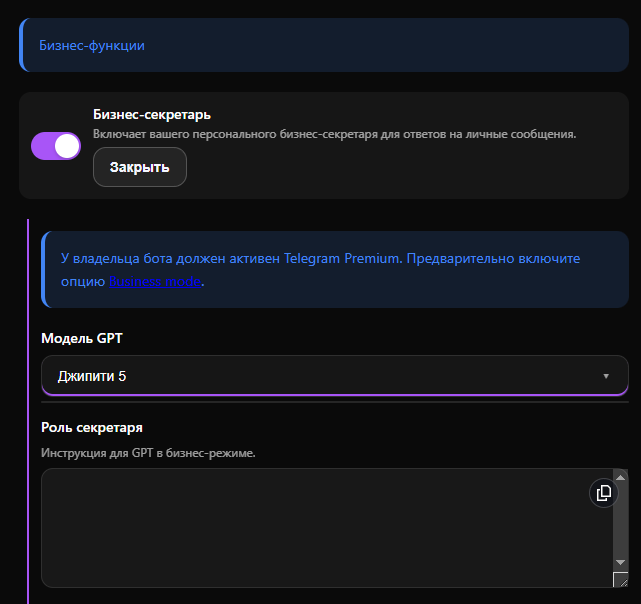
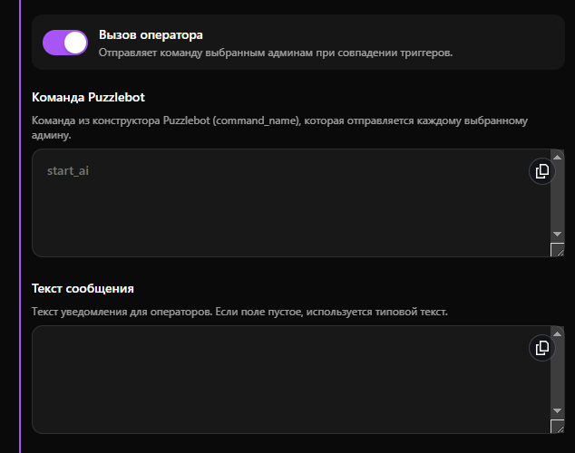
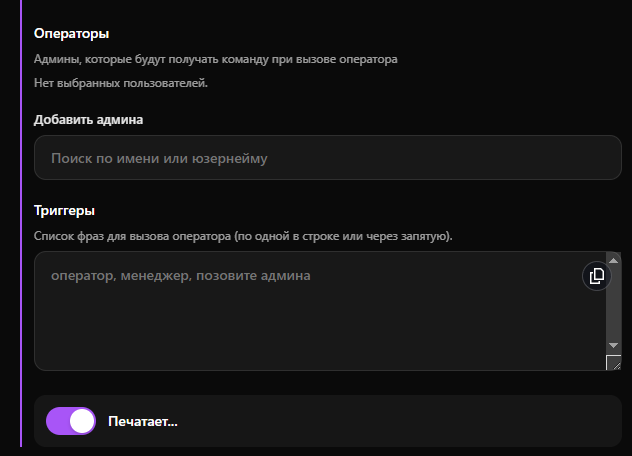

# Бизнес-секретарь

Функция **Бизнес-секретарь** позволяет подключить нейросеть к вашему личному Телеграм-аккаунту для автоматической обработки входящих личных сообщений. ИИ выступает в роли вашего персонального ассистента: он может консультировать клиентов, отвечать на частые вопросы по заранее заданным правилам и при необходимости переводить диалог на живого менеджера.

***

**Важно:** Для корректной работы функции ваш Telegram-аккаунт должен соответствовать двум требованиям:

1. Наличие активной подписки **Telegram Premium**.
2. В настройках самого приложения Telegram должен быть активирован режим **Business mode** (Telegram Business).


Доступно для тарифов Бизнес и Комплекс. Подробнее во вкладке [Тарифы](https://www.google.com/search?q=/getting-started/tarify)


***

#### Предварительные настройки

**Активация Business Mode.**

1. Откройте бот [@BotFather](https://t.me/botfather).
2. Отправьте команду `/mybots` и выберите нужного бота.
3. Нажмите Bot Settings -> Business Mode -> Turn On.

**Связывание Telegram и PuzzleBot**

1. В настройках Telegram:
   * Перейдите в настройки вашего профиля Telegram.
   * Откройте раздел `Бизнес-аккаунт` -> `Чат-бот`.
   * Выберите вашего бота и предоставьте ему доступ к необходимым чатам.
2. В настройках PuzzleBot:
   * Вернитесь в личный кабинет PuzzleBot и выберите вашего бота.
   * Нажмите кнопку "Добавить ресурс".
   * Добавьте ваш бизнес-аккаунт в качестве нового ресурса.

<figure><figcaption></figcaption></figure>

***

### Основные настройки

После того как аккаунт связан, перейдите в панель управления:

1. Откройте бот [@ChatGPT\_PuzzleBot](https://t.me/ChatGPT_PuzzleBot) -> Меню -> Настройки (шестеренка).
2. Вкладка Бизнес-функции -> Бизнес-секретарь -> «Открыть».

**Параметры конфигурации:**

<figure><figcaption></figcaption></figure>

* **Бизнес-секретарь:** Главный переключатель, активирующий работу нейросети на вашем аккаунте.
* **Модель GPT:** Выпадающий список для выбора языковой модели, которая будет обрабатывать сообщения. Выбор модели влияет на качество ответов и скорость реакции. Рекомендуется использовать актуальные версии (например, указанную на скриншоте «Джипити 5») для наиболее точного следования инструкциям.
* **Роль секретаря:** Ключевое поле для настройки поведения ИИ. Здесь необходимо подробно описать системную инструкцию (промпт). Укажите, от чьего лица должен общаться секретарь, какие задачи он решает, в каком тоне следует отвечать пользователям и какую информацию предоставлять. Чем детальнее прописана роль, тем точнее нейросеть будет закрывать ваши бизнес-задачи.

### Вызов оператора

Функционал бизнес-секретаря позволяет настроить сценарии, при которых бот передает управление живому сотруднику.&#x20;


Это необходимо для ситуаций, когда клиент задает нестандартный вопрос или напрямую просит связаться с менеджером.


Для настройки этой логики активируйте переключатель **Вызов оператора** и заполните следующие поля:

<figure><figcaption></figcaption></figure>

* **Команда Puzzlebot:** Поле для интеграции с конструктором ботов PuzzleBot. Укажите здесь техническое название команды (например, `start_ai` или `call_manager`). При срабатывании вызова оператора система автоматически отправит эту команду каждому выбранному администратору в вашем боте.
* **Текст сообщения:** Текст уведомления, который получат назначенные операторы, когда клиенту потребуется помощь. Если оставить это поле пустым, система отправит стандартный системный текст.

#### Настройка адресатов и триггеров

Чтобы система понимала, _кого_ именно нужно оповещать и в какой момент, необходимо настроить операторов и ключевые слова:

<figure><figcaption></figcaption></figure>

* **Операторы:** Список администраторов, которые будут получать команду из конструктора PuzzleBot. Для добавления сотрудника введите его имя или юзернейм в поле поиска.
* **Триггеры:** Список ключевых слов или фраз, при обнаружении которых в сообщении клиента ИИ должен позвать человека. Фразы можно вводить через запятую или каждую с новой строки (например: `оператор`, `менеджер`, `позовите админа`). Как только пользователь отправит сообщение, содержащее один из триггеров, бизнес-секретарь инициирует вызов назначенных операторов.

### Дополнительные опции

* **Печатает...:** Включение этого тумблера добавляет реалистичности общению с нейросетью. Перед отправкой ответного сообщения в чате у пользователя будет отображаться стандартный статус Telegram «печатает», имитирующий присутствие живого собеседника.

***

#### Тарифы и лимиты

* **Стоимость:** работа функции включена в тарифы Бизнес и Комплекс.
* **AI-запросы:** каждый ответ «секретаря» списывает запросы/токены согласно тарификации выбранной вами модели GPT. Подробнее в статье [AI-модели и стоимость](../../info/ai-modeli-i-stoimost.md#tekstovye-modeli).

***

Переход к следующему разделу: [Бизнес-функции - Диалоговые сессии](dialogovye-sessii.md).
