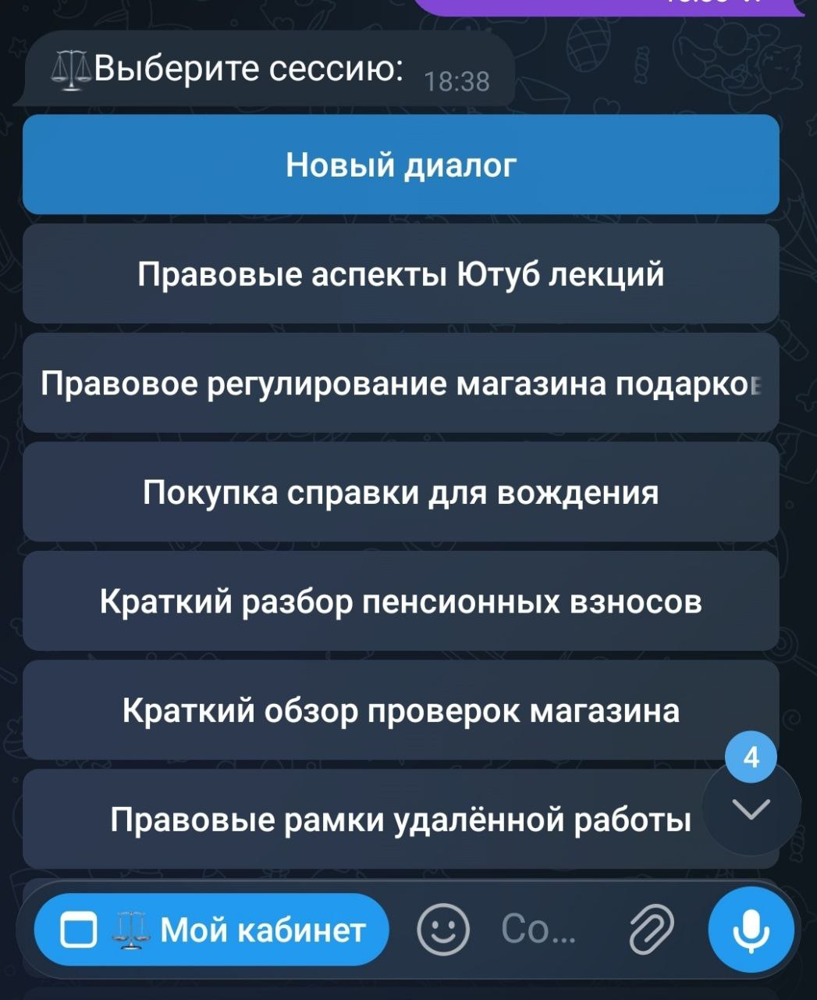

# Диалоговые сессии

**Диалоговые сессии** — это инструмент для сохранения и организации истории переписки с ИИ. Функция позволяет пользователю вести несколько независимых диалогов одновременно, не смешивая контексты разных обсуждений.

Без этой функции каждое новое сообщение пользователя наслаивается на предыдущее, что при резкой смене темы может запутать ИИ. Сессии решают следующие задачи:

* **Разделение тем:** пользователь может в одной сессии обсуждать юридические вопросы, а в другой — техническую поддержку. Контексты не будут перемешиваться.
* **Точность ответов:** история предыдущих обсуждений внутри конкретной сессии позволяет модели лучше понимать суть запроса и снижает вероятность галлюцинаций.
* **Удобство навигации:** пользователь может в любой момент вернуться к старому диалогу, перечитать его или продолжить общение с того места, где остановился.

<figure><figcaption></figcaption></figure>


Доступно для тарифов Бизнес и Комплекс. Подробнее во вкладке [Тарифы](../tarify/).&#x20;


***

#### Как это работает

При активации функции бот сохраняет историю сообщений для каждой отдельной сессии. Когда пользователь переключается между ними, система передает нейросети только тот набор данных (контекст), который относится к выбранной теме. Для пользователя это выглядит как список активных чатов внутри одного бота.

***

#### Настройка функции

Управление сессиями происходит внутри мини-приложения PxAI. Чтобы перейти к настройкам:

1. Откройте бот [@ChatGPT\_PuzzleBot](https://t.me/ChatGPT_PuzzleBot) и запустите главное меню.
2. Выберите нужного бота из списка подключенных.
3. Нажмите на иконку шестеренки (Настройки) в правом верхнем углу.
4. Перейдите во вкладку **Бизнес-функции.**
5. Активируйте «Диалоговые сессии» и нажмите «Открыть».

<figure><figcaption></figcaption></figure>

В открывшейся панели вы можете настроить внешний вид меню выбора сессий для вашего пользователя:

* **Текст сообщения выбора сессии**: задайте приветственный текст, который увидит пользователь при открытии списка своих диалогов (например, «Ваши обсуждения»).
* **Переименование сессий:** активация этого тумблера добавляет инлайн-кнопку, позволяющую пользователю дать свое название чату.
* **Сессия выбрана:** текст, который бот пришлет после входа в конкретный диалог.
  * _Подсказка:_ используйте тег `[название сессии]` для автоматической подстановки имени чата. Теги `[ред.]` или `[редактировать]` автоматически заменяются на кнопку переименования.
* **Цвет кнопки:** выберите цвет для главной кнопки создания «Нового диалога».

***

#### Тарифы и лимиты

Функция включена в стоимость тарифов Бизнес и Комплекс.

* Количество сохраняемых сессий на одного пользователя не ограничено.
* Само переключение между сессиями бесплатно. AI-запросы списываются только в момент отправки сообщения в нейросеть внутри выбранной сессии.

***

Переход к следующему разделу: [Бизнес-функции - Компоновка сообщений](komponovka-soobshenii.md)
