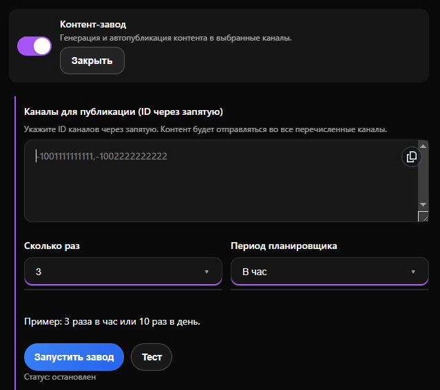

# Контент-завод

Функция **Контент-завод** предназначена для автоматической генерации и регулярной публикации постов в ваши Telegram-каналы. Этот инструмент берет на себя рутину по ведению каналов и позволяет настроить бесперебойный поток контента по заданному расписанию.

**Пример работы контент-завода:** [https://t.me/zakonnik\_channel](https://t.me/zakonnik_channel) (автоматическая публикация юридических новостей с фотографией)/


Доступно для тарифов Бизнес и Комплекс. Подробнее во вкладке [Тарифы](https://www.google.com/search?q=/getting-started/tarify)


***

### Как активировать функцию

Откройте бот [@ChatGPT\_PuzzleBot](https://t.me/ChatGPT_PuzzleBot), нажмите на Меню и перейдите в Настройки (шестеренка). Перейдите в раздел Бизнес-функции - **Контент-завод**, чтобы настроить каналы и расписание публикаций.&#x20;

Для активации работы модуля переведите переключатель в активное состояние:

<figure><figcaption></figcaption></figure>

#### Выбор каналов для публикации

Чтобы система понимала, куда именно отправлять готовые посты, необходимо указать идентификаторы нужных каналов.

* **Каналы для публикации (ID через запятую):** Вставьте в это поле системные ID ваших Telegram-каналов.
* Идентификаторы должны быть указаны в формате Telegram (обычно они начинаются с `-100`, например: `-1001111111111`).
* Если вы хотите настроить автопубликацию сразу в несколько каналов, перечислите их ID через запятую без пробелов (например: `-1001111111111,-1002222222222`). Сгенерированный контент будет отправляться во все перечисленные каналы.


**Подсказка:** Чтобы узнать системный ID вашего канала, вы можете воспользоваться специальными ботами в Telegram, которые показывают информацию о пересланных сообщениях. Например: [https://t.me/LeadConverterToolkitBot](https://t.me/LeadConverterToolkitBot)

* Запустите бота и перешлите сообщение от вашего канала. В ответ вы получите идентификатор, начинающийся на -100

.png>)


#### Настройка планировщика

Автопубликация работает на основе встроенного планировщика. Вы можете гибко настроить частоту выхода постов с помощью двух выпадающих списков:

<figure><figcaption></figcaption></figure>

* **Сколько раз:** Укажите желаемое количество публикаций (от 1 до 10).
* **Период планировщика:** Выберите временной интервал, в течение которого должно выйти указанное количество постов (например, «В час» или «В день»).

_Пример:_ Если вы выберете «3» в поле количества и «В час» в поле периода, система будет автоматически генерировать и публиковать по 3 поста каждый час. Если выбрать «10» и «В день» — будет выходить 10 постов в сутки.

### Управление процессом

После того как все поля заполнены, вы можете протестировать или сразу запустить автоматизацию.

<figure><figcaption></figcaption></figure>

* **Кнопка «Тест»:** Рекомендуется использовать перед основным запуском. Нажатие на эту кнопку инициирует разовую генерацию и отправку поста. Это отличный способ проверить, правильно ли указаны ID каналов и как выглядит итоговый контент.
* **Кнопка «Запустить завод»:** Главная кнопка старта. После её нажатия система начнет работу по заданному вами расписанию. Текст на кнопке изменится, позволяя при необходимости остановить процесс.
* **Статус:** Под кнопками управления всегда отображается текущее состояние модуля (например, _«Статус: остановлен»_), что позволяет вам в любой момент понять, активна ли автопубликация.

***

#### Тарифы и лимиты

* **Стоимость:** работа функции включена в тарифы Бизнес и Комплекс.
* **AI-запросы:** каждый ответ «секретаря» списывает запросы/токены согласно тарификации выбранной вами модели GPT. Подробнее в статье [AI-модели и стоимость](../../info/ai-modeli-i-stoimost.md#tekstovye-modeli).
