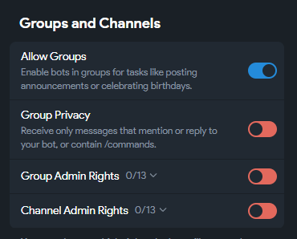
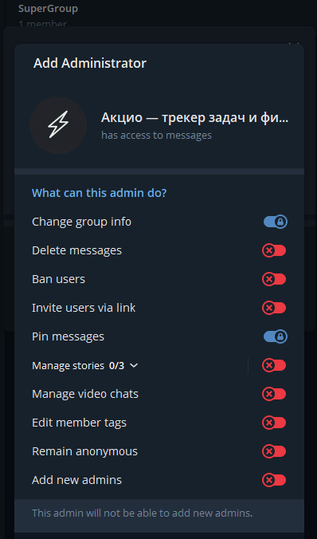
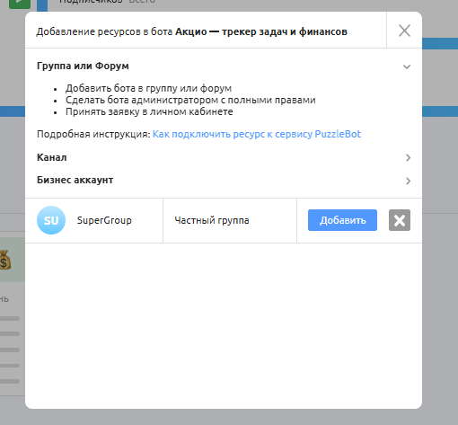
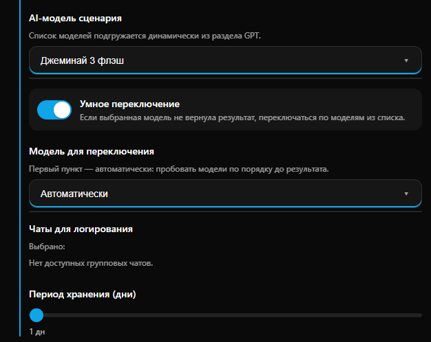

# Сценарии автоматизации

**Сценарии автоматизации** — это инструмент для автоматического сбора и последующего AI-анализа логов сообщений в выбранных вами чатах. Вместо того чтобы перечитывать сотни сообщений за день, вы получаете готовую аналитическую выжимку.

Функция позволяет за секунды получить саммари (краткий пересказ) обсуждения в команде за сутки или неделю, выделить ключевые поручения, дедлайны и ответственных лиц из общего потока переписки.

**Что дает:**

* **Экономия времени руководителя:** получение автоматических отчетов по итогам дня или недели.
* **Контроль задач:** ИИ автоматически извлекает из контекста поручения, сроки и ответственных.
* **Анализ активности:** возможность оценивать тональность общения в чатах или выделять самые обсуждаемые темы.


Доступно для тарифов Бизнес и Комплекс. Подробнее во вкладке [Тарифы](https://www.google.com/search?q=/getting-started/tarify).&#x20;


#### Важно!

Для корректной работы бот должен быть администратором группы. Выполните следующие шаги перед настройкой в ИИ-панели:

1. **В BotFather**: откройте настройки бота -> Bot Settings -> Allow Groups -> установите ON.
2. **В Группе**: добавьте бота в вашу группу и выдайте ему права Администратора.
3. **В Конструкторе PuzzleBot**: в разделе «Ресурсы» подключите эту группу к вашему боту.

<figure><figcaption></figcaption></figure> <figure><figcaption></figcaption></figure> <figure><figcaption></figcaption></figure>

Только после выполнения этих трех пунктов группа появится в списке доступных в ИИ-панели.

***

#### Настройка функции

Управление сценариями происходит внутри мини-приложения PxAI. Чтобы перейти к настройкам:

1. Откройте бот [@ChatGPT\_PuzzleBot](https://t.me/ChatGPT_PuzzleBot) и запустите главное меню.
2. Выберите нужного бота из списка подключенных.
3. Нажмите на иконку шестеренки (Настройки) в правом верхнем углу.
4. Перейдите во вкладку **Бизнес-функции**.
5. Активируйте «Сценарии автоматизации» и нажмите «Открыть».

В открывшейся панели настройте параметры сценария:

<figure><figcaption></figcaption></figure>

* **Триггер активации:** ключевое слово или фраза (например, `анализ`), при отправке которой в чат бота (НЕ в группу) запустится процесс генерации отчета.
* **Роль:** системная инструкция для ИИ, определяющая формат отчета. На примере задана инструкция: _«Отображай юзернеймы пользователей в формате "@username", если нет юзернейма - добавляй имя. Добавляй время сообщений в формате "12:00 мск"»_.


Для лучшего результата в поле «Роль» четко пропишите, что именно вы хотите получить. Например: _«Сделай саммари обсуждения за последние 24 часа. Выдели отдельным списком все поставленные задачи с указанием исполнителя и дедлайна»_.&#x20;


Выберите модель из списка подключенных в разделе GPT, которая будет проводить анализ. Рекомендуется использовать быстрые модели (например Джеминай 3 флэш, как на примере).

<figure><figcaption></figcaption></figure>

* **Чаты для логирования:** выберите группы, сообщения из которых система должна собирать. _Если список пуст, см. раздел выше._
* **Период хранения (дни)**: установите, как долго хранить логи для анализа (от 1 дня и более).

#### Тарифы и лимиты

Сбор логов (хранение данных) осуществляется бесплатно на тарифах Бизнес и Комплекс в рамках доступного периода хранения.
