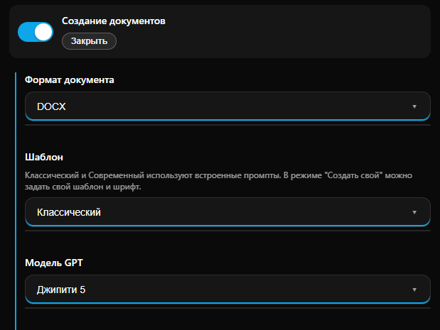
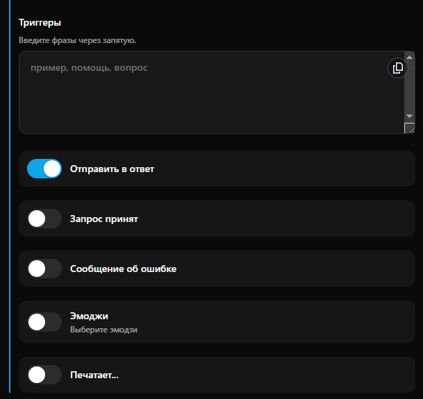

# Создание документов

**Создание документов** — это инструмент для автоматической генерации файлов на основе текстовых запросов пользователя. Функция позволяет боту не просто отправлять текстовое сообщение, а формировать полноценный документ в заданном формате, готовый к скачиванию и печати.

**Пример документа (сформирован ИИ):**

<figure><figcaption></figcaption></figure>

Автоматическая генерация файлов упрощает работу с типовым контентом и отчетностью:

* **Формирование документов**: создавайте справки, заявления, конспекты или отчеты сразу в формате PDF или DOCX.
* **Профессиональное оформление**: используйте встроенные или собственные шаблоны для соблюдения корпоративного стиля.
* **Удобство для пользователя**: клиент получает файл, который легко сохранить, переслать или распечатать, в отличие от длинного текстового сообщения.


Доступно для тарифов Бизнес и Комплекс. Подробнее во вкладке [Тарифы](../tarify/).&#x20;


***

#### Настройка функции

Управление функцией происходит внутри мини-приложения PxAI. Чтобы перейти к настройкам:

1. Откройте бот [@ChatGPT\_PuzzleBot](https://t.me/ChatGPT_PuzzleBot) и запустите главное меню.
2. Выберите нужного бота из списка подключенных.
3. Нажмите на иконку шестеренки (Настройки) в правом верхнем углу.
4. Перейдите во вкладку **Бизнес-функции**.
5. Активируйте «Создание документов» и нажмите «Открыть».

В основном блоке настроек определяются характеристики документа:

<figure><figcaption></figcaption></figure>

* **Формат документа:** выберите расширение из доступных — DOCX, ODT, TXT, PDF.
* **Шаблон:** выберите стиль оформления. Режимы «Классический» и «Современный» используют встроенные промпты, а в режиме «Создать свой» можно задать индивидуальный шаблон и шрифт.
* **Модель GPT:** выберите нейросеть (например, Джипити 5), которая будет отвечать за генерацию текстового наполнения документа.

**Триггеры и реакция бота**

<figure><figcaption></figcaption></figure>

* **Триггеры:** введите фразы через запятую, на которые бот будет реагировать созданием документа.
* **Визуальные настройки:** включите опции для информирования пользователя о ходе генерации:
  * Отправить в ответ: файл будет прикреплен к сообщению пользователя.
  * Запрос принят / Печатает...: отображение статуса работы бота.
  * Сообщение об ошибке: уведомление пользователя, если генерация не удалась.
  * Эмоджи: выбор иконки для визуального подтверждения действия.

***

#### Тарифы и лимиты

* Генерация документа списывает AI-запросы в соответствии с выбранной моделью GPT.
* Дополнительная плата за само формирование файла (конвертацию в PDF/DOCX) на тарифах Бизнес и Комплекс не взимается.

***

Переход к следующему разделу: [Бизнес-функции - Сценарии автоматизации](scenarii-avtomatizacii.md).
