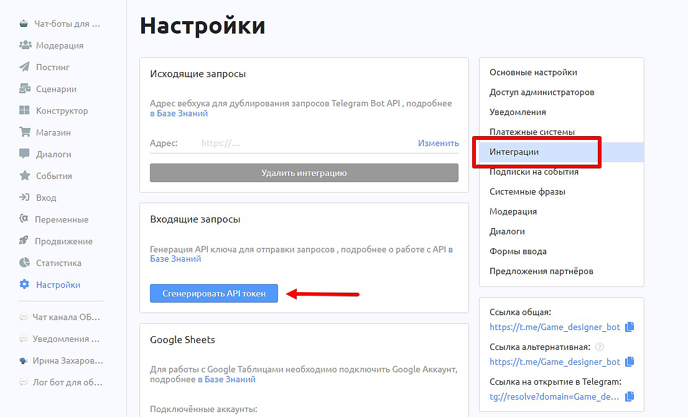
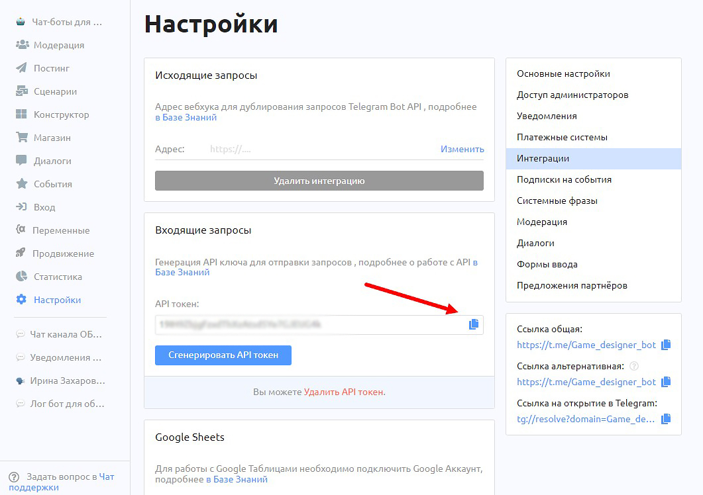
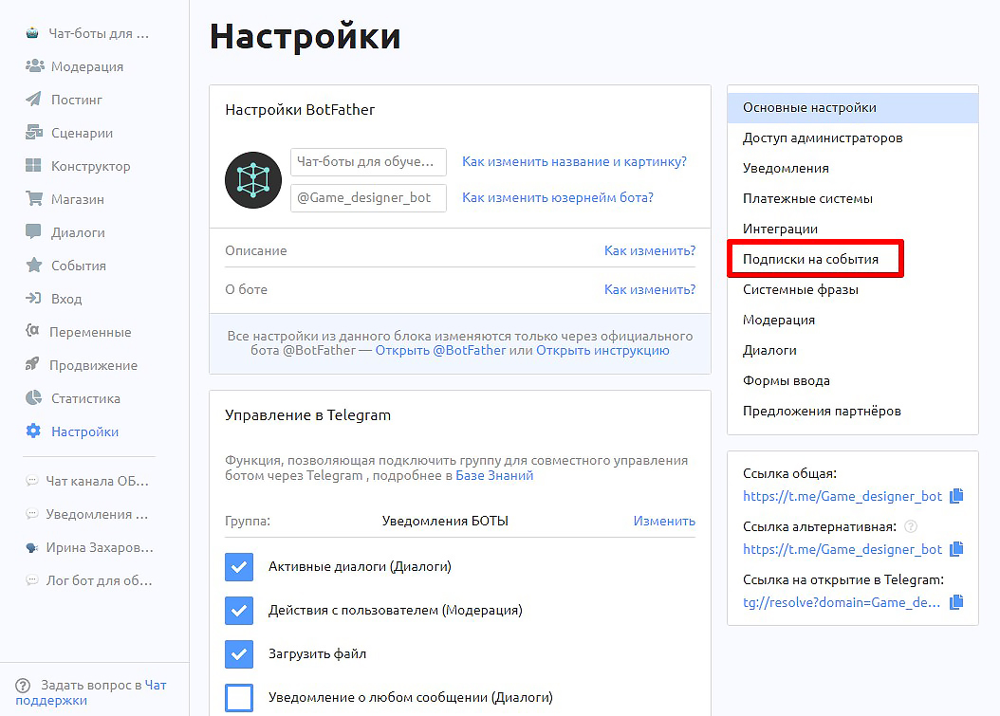
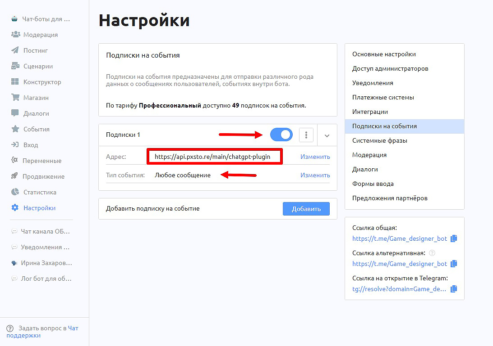
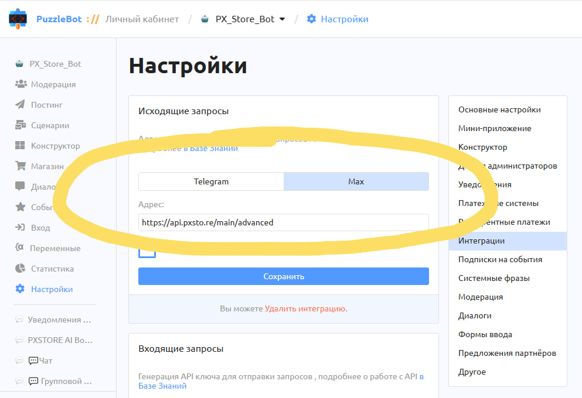

# Быстрый старт

Эта инструкция поможет подключить ИИ-функции к вашему боту в Telegram или MAX.

В результате ваш бот сможет отвечать через AI-модели, генерировать изображения, видео, музыку и выполнять другие AI-задачи.


Весь процесс обычно занимает около 5–7 минут.


***

## Что потребуется

Перед началом подготовьте:

1. **Бот в Telegram или MAX**, к которому вы хотите подключить ИИ-функции.
2. **Личный кабинет** [**PuzzleBot**](https://puzzlebot.top/?r=wQxqYExC)**.** В нём вы будете управлять ботом, сценариями, командами и интеграциями.
3. **Токен бота.** Он нужен, чтобы добавить бота в PuzzleBot.
4. **API-токен PuzzleBot.** Он нужен, чтобы PxAI мог обмениваться данными с вашим ботом через PuzzleBot.
5. **Доступ к Telegram-боту** [**@ChatGPT\_PuzzleBot**](https://t.me/chatgpt_puzzlebot)**.** Через него бот подключается к PxAI.

***

## Шаг 1. Создайте бота в Telegram или MAX

Сначала нужно создать бота в выбранном мессенджере и получить токен доступа.

### Если вы создаёте бота в Telegram

1. Откройте Telegram.
2. Найдите бота **@BotFather**.
3. Отправьте команду **/newbot**.
4. Введите имя бота, например: **AI Ассистент**.
5. Введите username бота. Username должен быть написан латиницей и заканчиваться на `bot`. Например: `my_new_ai_bot`
6. Скопируйте полученный **HTTP API-token**. Это длинная строка из цифр и букв. Сохраните её в надёжном месте.

### Если вы создаёте бота в MAX

1. Создайте бота в MAX через доступный в мессенджере способ создания ботов.
2. Получите токен доступа для подключения бота.
3. Скопируйте токен и сохраните его в надёжном месте.


Важно: по этому токену можно управлять ботом. Не передавайте его третьим лицам.


***

## Шаг 2. Добавьте бота в PuzzleBot

Теперь нужно добавить созданного бота в конструктор PuzzleBot, чтобы управлять его логикой, сценариями и интеграциями.

1. Перейдите на сайт [**puzzlebot.top**](https://puzzlebot.top/?r=wQxqYExC).
2. Нажмите **«Войти»** или **«Начать бесплатно»**.
3. Авторизуйтесь в личном кабинете PuzzleBot.
4. После входа система предложит добавить нового бота.
5. Вставьте токен бота, который вы получили при создании бота в Telegram или MAX.
6. Нажмите **«Добавить бота»**.

После этого бот появится в вашем личном кабинете PuzzleBot.

***

## Шаг 3. Получите API-токен PuzzleBot

Теперь нужно получить API-токен конструктора PuzzleBot.

<figure><figcaption></figcaption></figure>

<figure><figcaption></figcaption></figure>

Этот токен отличается от токена бота. Он нужен для связи PuzzleBot с PxAI и другими внешними сервисами.

1. Откройте личный кабинет PuzzleBot.
2. Выберите нужного бота.
3. Перейдите в раздел:

**Настройки → Интеграции → Входящие запросы**

4. Нажмите **«Сгенерировать API-токен»**, если токен ещё не был создан.
5. Скопируйте полученный токен.

Если API-токен уже создавался раньше, вы можете использовать его же.

Если вы сгенерируете новый токен, старый перестанет работать.

***

## Шаг 4. Передайте API-токен PuzzleBot в PxAI

Теперь нужно подключить вашего бота к PxAI.

Для этого используется сервисный бот **@ChatGPT\_PuzzleBot**.

1. Откройте [**@ChatGPT\_PuzzleBot**](https://t.me/ChatGPT_PuzzleBot).
2. В главном меню нажмите синюю карточку **«Добавить (Новый бот)»**.
3. Вставьте скопированный ранее API-токен PuzzleBot в поле **«Токен из PuzzleBot»**.
4. Нажмите **«Продолжить»**.

<figure><figcaption></figcaption></figure>

После этого ваш проект появится в общем списке со статусом **«Активен»**.

***

## Шаг 5. Добавьте подписку на события

Подписка на события нужна, чтобы сообщения пользователей передавались из PuzzleBot в PxAI.

1. Перейдите в личный кабинет PuzzleBot.
2. Выберите нужного бота.
3. Откройте раздел **«Настройки»**.
4. Найдите вкладку **«Подписки на события»**.
5. Нажмите **«Добавить»**.
6. Укажите адрес: `https://api.pxsto.re/main/chatgpt-plugin`
7. Выберите тип события: **«Любое сообщение»**
8. Сохраните подписку.
9. Активируйте переключатель подписки.

<figure><figcaption></figcaption></figure>

<figure><figcaption></figcaption></figure>

После этого PuzzleBot сможет передавать входящие сообщения пользователей в PxAI.

***

## Шаг 6. Подключите расширенные функции PxAI

Этот шаг нужен для работы дополнительных кнопок и расширенных функций PxAI, например ChatGPT, Midjourney и других AI-инструментов.

1. Откройте личный кабинет PuzzleBot.
2. Выберите нужного бота.
3. Перейдите в раздел:

**Настройки → Интеграции → Исходящие запросы**

4. Выберите вкладки с подключенными к боту мессенджерами (Телеграм / Макс) и вставьте во всех из них адрес: `https://api.pxsto.re/main/advanced`
5. Нажмите **«Сохранить»**.

<figure><figcaption></figcaption></figure>

***

## Готово

Ваш бот подключен к PxAI.

Теперь он может использовать ИИ-функции внутри сценариев PuzzleBot: отвечать на сообщения пользователей, обращаться к выбранным AI-моделям, генерировать изображения, видео, музыку и выполнять другие AI-задачи.

Пользователь продолжает взаимодействовать с вашим ботом в Telegram или MAX, а PxAI работает «под капотом»: принимает запрос, обращается к нужной AI-модели, возвращает результат в бот и применяет заданные правила списания AI-запросов.

Чтобы настроить поведение бота, выбрать модели, задать роль, лимиты и стоимость запросов, перейдите в раздел **«**[**Настройки и управление**](nastroiki-i-upravlenie/)**»**.

