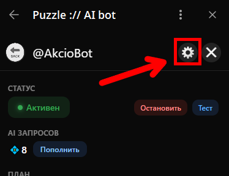

# Настройки и управление

После того как вы привязали своего бота к PxAI, необходимо настроить его логику: от того, на какие сообщения он будет отвечать, до выбора конкретных моделей генерации контента.

***

Чтобы открыть панель управления вашим ботом, выполните следующие шаги:

1. Перейдите в бот [@ChatGPT\_PuzzleBot](https://t.me/ChatGPT_PuzzleBot) в Telegram.
2. Нажмите на кнопку **Menu** в левом нижнем углу и запустите основное мини-приложение.
3. В открывшемся списке выберите нужного бота (которого вы подключили ранее).
4. Нажмите на иконку шестеренки в правом верхнем углу.

<figure><figcaption></figcaption></figure>

***

#### Что вы найдете в этом разделе

Для удобства навигации настройки разбиты на несколько логических блоков. Вы можете изучать их по порядку или перейти к конкретному инструменту:

* [Основные](osnovnye.md) — управление работой ИИ в личных сообщениях и группах, установка триггерных слов и лимитов на длину текста.
* [Модерация](moderaciya.md) — фильтрация спама, настройка авторизации новых пользователей и использование ИИ для защиты чата.
* [Текст](tekst.md) — выбор моделей GPT, настройка системной роли (промпта) и режима «стриминга» ответов.
* [Фото](foto.md) / [Видео](video.md) / [Музыка и голос](muzyka-i-golos.md) — все, что касается генерации и обработки медиафайлов: от Midjourney и Flux до создания музыки и транскрибации голоса.
* [Бизнес-функции](../biznes-funkcii/) — профессиональные инструменты для работы с документами, супер-роли на 50 000 знаков и сценарии аналитики чатов.

***
