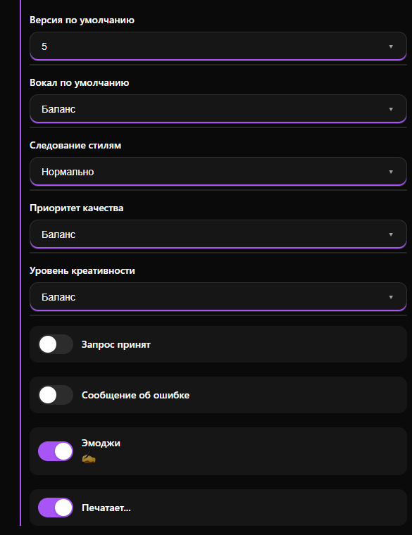
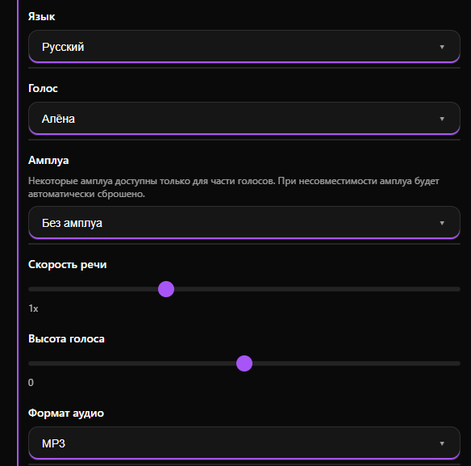

# Музыка и голос

Раздел объединяет инструменты для генерации музыки, преобразования текста в речь (синтез) и перевода голосовых сообщений в текст (транскрибация).

***

### Музыка и голос

Для создания полноценных музыкальных треков по текстовому описанию используется модель **Суно**.

<figure><figcaption></figcaption></figure> <figure><figcaption></figcaption></figure>

При нажатии «Открыть» доступны расширенные настройки:

* **Триггеры** — слова, запускающие процесс создания музыки.
* **Модель Suno** — выбор версии (от 3 до 5).
* **Режим по умолчанию** — выбор между простым и кастомным (продвинутым) режимом настройки.
* **Теги стиля** — ключевые слова для определения жанра и настроения (например: `pop, electronic, cinematic`).
* **Нежелательные теги** — теги-исключения для предотвращения артефактов (например: `шум, клиппинг`).
* **Вокал / Следование стилям / Приоритет качества / Уровень креативности** — ползунки и списки для точной настройки баланса между голосом, качеством записи и точностью следования вашему промпту.
* **Сервисные настройки** — включение уведомлений о принятии запроса, статус «Печатает...» и использование эмодзи.

***

### Синтез речи (Text-to-Speech)

Позволяет боту озвучивать текстовые ответы выбранным голосом. Доступны две основные платформы: **Яндекс Спич** и **Сбер Спич**.

<figure><figcaption></figcaption></figure> <figure><figcaption></figcaption></figure>

При нажатии «Открыть» доступны расширенные настройки:

* **Голос** — выбор диктора. У каждого провайдера своя уникальная библиотека голосов (например, Алёна, Наталья и др.).
* **Амплуа / Эмоция** — настройка тональности голоса (радостный, строгий, нейтральный). Доступность зависит от выбранного голоса.
* **Язык** — выбор языка озвучки.
* **Скорость речи / Высота голоса** — техническая корректировка звучания.
* **Формат аудио** — выбор расширения файла на выходе (MP3, OGG, WAV).

***

### Транскрибация голоса (Speech-to-Text)

Функция перевода голосовых сообщений пользователей в текстовый формат. В системе доступно 3 модели транскрибации: **Виспер, Яндекс Спич и Сбер Спич.**

<figure><figcaption></figcaption></figure>

Режимы обработки:

* **Расшифровка голоса в текст** — бот просто присылает дословную текстовую расшифровку того, что было сказано в аудиосообщении.
* **Расшифровка + обработка GPT** — после получения текста сообщения система передает его нейросети. ИИ обработает текст согласно вашей Системной роли из раздела «Текст» (например, может исправить ошибки, сделать краткий пересказ или ответить на вопрос из голосового сообщения).

> Эти два переключателя взаимоисключающие. При включении одного режима второй отключается автоматически.

Для вступления настроек в силу нажмите кнопку «Применить».

***

На этом базовые настройки завершены.&#x20;

Для дополнительных настроек перейдите в раздел [Бизнес-функции](../biznes-funkcii/).
