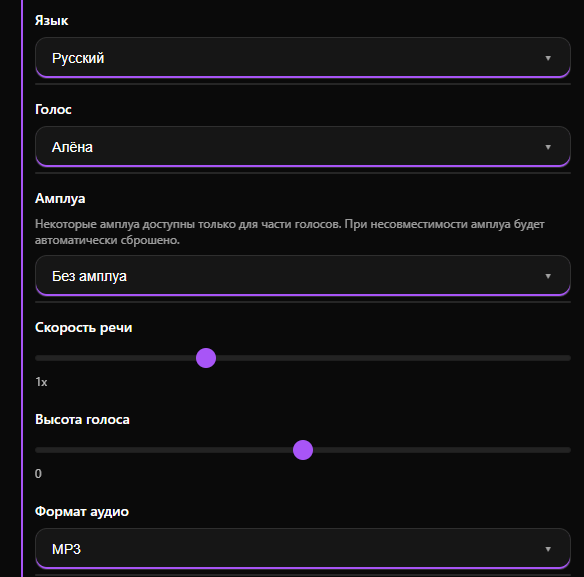

# Музыка и голос

Раздел объединяет инструменты для генерации музыки, преобразования текста в речь (синтез) и перевода голосовых сообщений в текст (транскрибация). В каталоге модели разделены на две категории: **«Музыка»** и **«Голос»**.

***

### Музыка

Для музыки доступны четыре модели:

* **Suno** — песни, каверы, ремастеринг, разделение дорожек и редактирование фрагментов.
* **Producer** — генерация и точечная замена музыки, вокала или инструментала.
* **QW Music** — песня по описанию, своему тексту, стилю или мелодии-референсу.
* **FlowMusic** — генерация, продление, замена фрагмента и экспорт.

После выбора модели сначала укажите операцию. Форма автоматически покажет только нужные поля и пересчитает стоимость.

В Suno доступны, например:

* **Триггеры** — слова, запускающие процесс создания музыки.
* **Модель Suno** — `chirp-v6`, `chirp-v6-wild` или `chirp-v6-mini`.
* **Операция** — генерация, кавер, продление, stems, обрезка, ремастеринг и другие действия.
* **Теги стиля** — ключевые слова для определения жанра и настроения (например: `pop, electronic, cinematic`).
* **Нежелательные теги** — теги-исключения для предотвращения артефактов (например: `шум, клиппинг`).
* **Вокал / Следование стилям / Приоритет качества / Уровень креативности** — ползунки и списки для точной настройки баланса между голосом, качеством записи и точностью следования вашему промпту.
* **Сервисные настройки** — включение уведомлений о принятии запроса, статус «Печатает...» и использование эмодзи.

Поле **Тонкая настройка** → **Голос трека** повторяет голос из уже готового Suno-трека или ранее сохранённой персоны. Обычную загруженную запись нельзя превратить в голос-персону: Suno отклоняет такую операцию.

Чтобы оставить в песне именно ваш голос, выберите операцию **Музыка** (**Добавить музыку**), нажмите **Записать голос** либо загрузите MP3, WAV или OGG. Если нажать **Загрузить свой вокал** в тонкой настройке создания трека, Студия сама откроет этот рабочий режим с уже загруженным файлом. Опишите сопровождение и запустите обработку — Suno добавит музыку к исходному вокалу. Для записи прямо в Студии браузеру или WebView потребуется доступ к микрофону.

[Все музыкальные модели, операции и стоимость](../../info/muzykalnye-modeli-i-operacii.md)

***

### Синтез речи (Text-to-Speech)

Позволяет боту озвучивать текстовые ответы выбранным голосом. Доступны две основные платформы: **Яндекс Спич** и **Сбер Спич**.

<figure><figcaption></figcaption></figure>

При нажатии «Открыть» доступны расширенные настройки:

* **Голос** — выбор диктора. У каждой модели доступен свой набор голосов (например, Алёна, Наталья и др.).
* **Амплуа / Эмоция** — настройка тональности голоса (радостный, строгий, нейтральный). Доступность зависит от выбранного голоса.
* **Язык** — выбор языка озвучки.
* **Скорость речи / Высота голоса** — техническая корректировка звучания.
* **Формат аудио** — выбор расширения файла на выходе (MP3, OGG, WAV).

***

### Транскрибация голоса (Speech-to-Text)

Функция перевода голосовых сообщений пользователей в текстовый формат. В системе доступно 3 модели транскрибации: **Voxtral Mini Transcribe, Яндекс Спич и Сбер Спич.**

Режимы обработки:

* **Расшифровка голоса в текст** — бот просто присылает дословную текстовую расшифровку того, что было сказано в аудиосообщении.
* **Расшифровка + обработка GPT** — после получения текста сообщения система передает его нейросети. ИИ обработает текст согласно вашей Системной роли из раздела «Текст» (например, может исправить ошибки, сделать краткий пересказ или ответить на вопрос из голосового сообщения).

> Эти два переключателя взаимоисключающие. При включении одного режима второй отключается автоматически.

Для вступления настроек в силу нажмите кнопку «Применить».

***

На этом базовые настройки завершены.&#x20;

Для дополнительных настроек перейдите в раздел [Бизнес-функции](../biznes-funkcii/).
