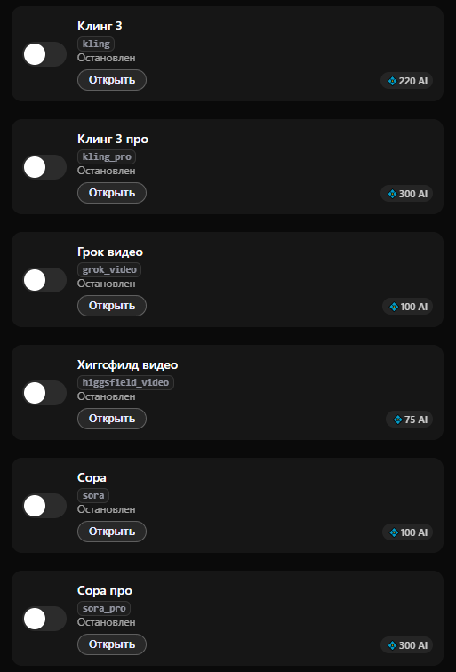

# AI модерация чата

Данный кейс позволяет настроить бота для фоновой проверки всех сообщений в группе.

#### Шаг 1. Подготовка в BotFather

Чтобы бот мог работать в группах, необходимо активировать соответствующий режим в настройках Telegram:

<figure><figcaption></figcaption></figure>

1. Перейдите в [@BotFather](https://t.me/botfather) -> Open -> выберите вашего бота.
2. Нажмите Bot Settings -> Groups -> установите Allow Groups в статус ON.
3. Там же убедитесь, что Group Privacy установлен в статус DISABLED, чтобы бот мог видеть все сообщения в чате для их анализа.
4. Добавьте бота в нужную группу и назначьте его Администратором.

<figure><figcaption></figcaption></figure>

***

#### Шаг 2. Основные настройки логики

Для того чтобы бот работал только как модератор и не расходовал баланс на случайные ответы, примените следующие настройки в вашем личном кабинете PxAI ([https://t.me/ChatGPT\_PuzzleBot](https://t.me/ChatGPT_PuzzleBot)).

1. **Основные:**

* Отключите «Работает в боте».
* Включите «Работает в групповых чатах».&#x20;
* Отключите тумблеры «Отвечает на все сообщения», «Отвечать на reply», «Отвечать на упоминание» и «Отвечать на триггерные слова».

Это гарантирует, что бот будет анализировать сообщения только через фильтр антиспама, не вступая в диалоги.

<figure><figcaption></figcaption></figure>

2. **Отключение медиа-моделей**

Перейдите в разделы Фото, Видео, Музыка и голос и убедитесь, что все модели генерации отключены. Это исключит лишние списания, если кто-то из пользователей попробует вызвать эти функции в группе.

<figure><figcaption></figcaption></figure> <figure><figcaption></figcaption></figure>

***

**3. Настройка AI-антиспама**

Перейдите в раздел Модерация для настройки правил фильтрации:

<figure><figcaption></figcaption></figure>

1. Включите тумблер «Антиспам» и  «AI антиспам».
2. В поле «Антиспам роль» опишите правила модерации. Инструкция должна возвращать результат в формате `true` (нарушение) или `false` (норма).
   * _Пример роли:_ «Верни true, если сообщение содержит рекламу сторонних ресурсов, ссылки на мошеннические сайты, нецензурную лексику или массовый спам. В остальных случаях верни false».
3. По умолчанию работает быстрая и экономичная модель **Джипити 5 нано беспл**., так как для модерации не требуется сложная логика.

***

#### Экономика и тарифы

Модерация требует закладывать бюджет на проверку каждого сообщения в группе.

| **Параметр**        | **Условие**                                                                                                                                                           |
| ------------------- | --------------------------------------------------------------------------------------------------------------------------------------------------------------------- |
| Стоимость проверки  | 1 AI-запрос за каждое сообщение в чате.                                                                                                                               |
| Рекомендуемый тариф | Премиум.                                                                                                                                                              |
| Дополнительно       | Рекомендуется докупить [пакет AI-запросов](../../getting-started/tarify/pakety-ai-zaprosov.md) (например, 10 000 или 50 000), если в вашей группе высокая активность. |

***

#### Что дальше?

Если вам нужно, чтобы бот не только модерировал чат, но и создавал отчеты об активности в конце дня, ознакомьтесь с бизнес-функцией [Сценарии автоматизации](../../getting-started/biznes-funkcii/scenarii-avtomatizacii.md).

#### Решение под ключ

Если вам необходимо внедрить систему AI-антиспама в крупное сообщество или настроить сложную многоуровневую фильтрацию с учетом специфических правил вашего бизнеса, вы можете заказать разработку у нашей команды. Мы настроим логику, подготовим промпты и проведем тестирование системы.

Для обсуждения задачи напишите нам: [t.me/pxsto\_re](https://t.me/pxsto_re).
