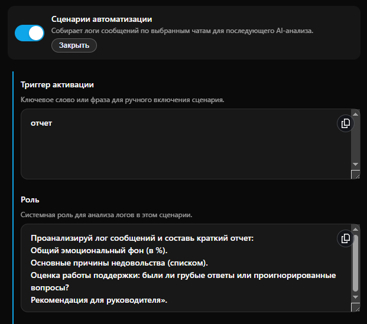

# Анализ тональности чата поддержки

**Анализ тональности (Sentiment Analysis)** — это процесс автоматического определения эмоциональной окраски сообщений в группе. С помощью этого кейса руководитель может за 1 минуту понять, довольны ли клиенты продуктом и насколько вежливо отвечает поддержка.

***

#### Что понадобится для настройки

Для реализации этого кейса необходима функция [Сценарии автоматизации](../../getting-started/biznes-funkcii/scenarii-avtomatizacii.md), которая доступна на тарифах Бизнес и Комплекс.

1. **Telegram:** Бот должен быть добавлен в чат поддержки как администратор (настройка `Allow Groups` в BotFather должна быть ON).
2. **Ресурсы:** Чат поддержки должен быть подключен как ресурс в конструкторе PuzzleBot.
3. **Тариф:** Бизнес или Комплекс (для доступа к фоновому логированию сообщений).

***

#### Пошаговая настройка сценария

Перейдите в Настройки -> Бизнес-функции -> Сценарии автоматизации. Активируйте переключатель и заполните поля в следующем порядке:

<figure><figcaption></figcaption></figure>

* **Триггер активации.** Введите слово или фразу, по которой бот пришлет вам аналитический отчет (например: `анализ` или `отчет`). _Писать триггер нужно в личные сообщения боту, а не в группу._
* **Роль.** Инструкция для ИИ, определяющая формат отчета. Пример эффективной роли для этого кейса:

> «Проанализируй лог сообщений и составь краткий отчет:
>
> 1. Общий эмоциональный фон (в %).
> 2. Основные причины недовольства (списком).
> 3. Оценка работы поддержки: были ли грубые ответы или проигнорированные вопросы?
> 4. Рекомендация для руководителя».

<figure><figcaption></figcaption></figure>

* **AI-модель сценария.** Выберите модель, которая будет анализировать логи. Для больших объемов текста рекомендуем **Джеминай 3 флэш** — она быстро обрабатывает длинный контекст.
* **Умное переключение.** Активируйте этот переключатель, чтобы в случае временной недоступности основной модели запрос автоматически ушел к резервной. Это гарантирует получение отчета в любой ситуации.&#x20;
* **Модель для переключения.** Выберите вторую модель (например, Джипити 5 нано  беспл.), которая подстрахует основную.
* **Чаты для логирования.** Выберите ваш чат поддержки из списка подключенных групп. Система начнет записывать историю сообщений в фоновом режиме сразу после выбора.
* **Период хранения (дни).** Установите, за какой срок ИИ должен анализировать данные. Для ежедневного контроля достаточно 1 дня, для еженедельного — 7 дней.

***


**Результат:** Отправив одно слово `анализ` своему боту, вы получаете  выжимку из вашего сообщества за сутки. Это позволяет держать руку на пульсе бизнеса, тратя на это минимум времени.

