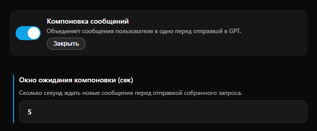

# Бот-эксперт с базой знаний

**Бот-эксперт** — это готовое решение для компаний, которым нужно автоматизировать ответы на сложные вопросы клиентов или сотрудников. В отличие от обычного чат-бота, который дает общие ответы, эксперт опирается на загруженные вами файлы и четко следует заданным инструкциям.

#### Какую задачу решает этот кейс?

* **Снижение нагрузки на сотрудников:** ИИ берет на себя до 80% типовых вопросов по продукту или услуге.
* **Мгновенная поддержка 24/7:** клиенты получают точные технические ответы в любое время суток.
* **Единый стандарт ответов:** бот не ошибается в ценах, не забывает условия доставки и всегда вежлив.

***

#### Используемые инструменты

Для реализации этого кейса мы объединим несколько ключевых функций Puzzle AI:

1. **Супер-роль:** для загрузки документов и создания базы знаний.
2. **Диалоговые сессии:** чтобы бот не путал контекст при длительном общении.
3. **Компоновка сообщений**: для экономии баланса и логически завершенных ответов.


Потребуется тариф **Бизнес** или **Комплекс**. Подробнее в разделе [Тарифы.](../../getting-started/tarify/)


***

#### Пошаговая настройка

**1. Подготовка базы знаний (Супер-роль)**

Перейдите в Настройки -> Бизнес-функции -> [Супер-роль](../../getting-started/biznes-funkcii/super-rol.md).

<figure><figcaption></figcaption></figure>

* **Загрузка документов:** добавьте до 15 файлов (PDF, DOCX, TXT) с вашими регламентами или FAQ. Нажмите кнопку «Отправить».
*   Текст супер-роли: после конвертации проверьте текст. Рекомендуется добавить в начало инструкцию:

    > _«Используй предоставленный текст как единственный источник информации. Если в тексте нет ответа на вопрос пользователя, вежливо ответь, что не обладаешь такой информацией и предложи обратиться к менеджеру»._

**2. Организация диалога (Диалоговые сессии)**

Включите функцию [Диалоговые сессии](../../getting-started/biznes-funkcii/dialogovye-sessii.md).

<figure><figcaption></figcaption></figure>

* Это позволит пользователям сохранять историю переписки по разным вопросам (например, «Установка ПО» и «Оплата счета») отдельно.
* Установите текст выбора сессии (например: _«Выберите тему для консультации»_).

**3. Оптимизация ответов (Компоновка)**

Включите функцию [Компоновка сообщений](../../getting-started/biznes-funkcii/komponovka-soobshenii.md).

<figure><figcaption></figcaption></figure>

* Установите Окно ожидания на 3–5 секунд. Это позволит боту дождаться, пока пользователь отправит все уточняющие вопросы (часто люди пишут короткими фразами), и дать один точный ответ на всю группу сообщений.

**4. Выбор модели**

Для бота-эксперта критически важна точность.

<figure><figcaption></figcaption></figure>

* **Рекомендуемая модель:** Джеминай 3 Про или Джипити 5. У них самое большое окно контекста, что позволяет им учитывать весь объем загруженной Супер-роли при каждом ответе.

***

#### Экономика и тарифы

Реализация этого кейса доступна на тарифах Бизнес и Комплекс.

<table data-header-hidden><thead><tr><th width="200">Расход</th><th>Условие</th></tr></thead><tbody><tr><td>База знаний</td><td>До 50 000 символов — бесплатно. От 50 001 до 150 000 — доплата 15 AI-запросов к каждому ответу.</td></tr><tr><td>Списание за ответ</td><td>Стоимость 1 запроса выбранной модели GPT.</td></tr><tr><td>Экономия</td><td>Компоновка сообщений снижает расход баланса в 2–3 раза за счет склейки коротких фраз.</td></tr></tbody></table>


**Совет:** Если ваша база знаний очень большая, структурируйте документы с помощью четких заголовков. Это поможет ИИ быстрее находить нужные разделы и выдавать более точные цитаты.


***

#### **Решение под ключ**

Если вам нужно развернуть экспертную систему с интеграцией в CRM, сложной логикой формирования документов и многоуровневой базой знаний — мы сделаем это за вас. Наша команда подготовит промпты, структурирует ваши файлы и настроит все бизнес-процессы.

Для обсуждения задачи пишите нам: [t.me/pxsto\_re](https://t.me/pxsto_re).
