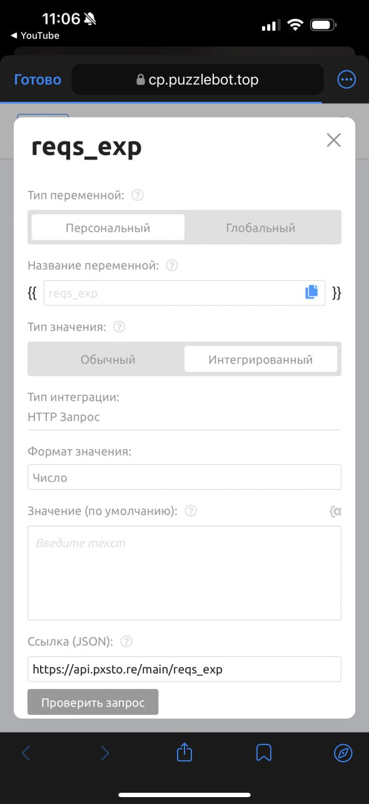

# Мониторинг остатка AI-запросов

Данная инструкция поможет вам настроить автоматическое отслеживание баланса AI-запросов вашего проекта прямо внутри вашего ИИ-бота. Это позволит вам своевременно узнавать о необходимости пополнения счета и информировать администраторов бота.

### Описание переменной

Переменная запрашивает актуальные данные через API pxsto.re и возвращает числовое значение — количество оставшихся запросов, доступных для вашего токена.

### Пошаговая настройка

Для создания переменной перейдите в личный кабинет [Puzzlebot](https://cp.puzzlebot.top/) и выполните следующие действия:

#### Шаг 1. Создание переменной

1. Перейдите в раздел «Переменные».
2. Нажмите кнопку создания новой переменной.
3. В поле «Название переменной» введите любое удобное имя (например, `ai_balance` или `reqs_exp`).
4. Установите следующие параметры:
   * Тип переменной: Персональный или Глобальный (в зависимости от ваших задач).
   * Тип значения: Интегрированный.
   * Тип интеграции: HTTP Запрос.
   * Формат значения: Число.

<figure><figcaption></figcaption></figure>

#### Шаг 2. Настройка запроса

В блоке настроек HTTP-запроса заполните следующие поля:

1. Ссылка (JSON): `https://api.pxsto.re/main/reqs_exp`
2. Тип запроса: `POST`
3. Вид запроса: Сформированный.
4. Ответ: выберите поле `req_remain` (оно появится после успешной проверки запроса).

<figure><figcaption></figcaption></figure>

#### Шаг 3. Передача токена

Для идентификации вашего аккаунта необходимо передать секретный ключ:

1. В блоке «Параметры» нажмите «Добавить параметр».
2. Ключ: `token`
3. Значение: Вставьте ваш _Токен._

### Использование в боте

Теперь созданную переменную можно использовать в любом текстовом блоке, условии или команде конструктора, просто вставив её название в двойных фигурных скобках.

Пример использования:

> _«Внимание! У бота осталось \{{reqs\_exp\}} AI-запросов. Пополните баланс в личном кабинете pxsto.re.»_
