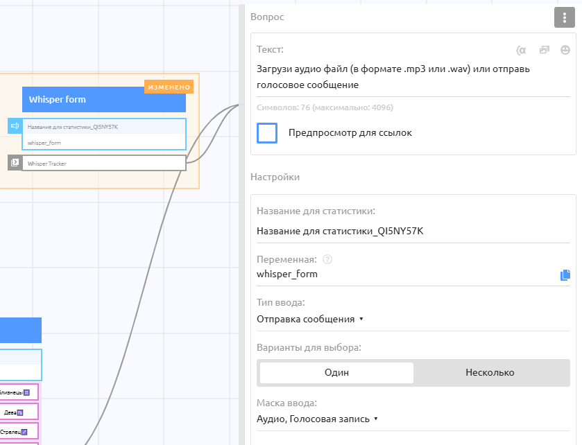

# GPT Audio

GPT Audio — это мощная модель от OpenAI для автоматического распознавания речи. Она позволяет обрабатывать аудиофайлы и голосовые сообщения и переводить их в текст.&#x20;

Для альтернативных ASR-моделей через OpenRouter используйте ключи из каталога [OpenRouter transcription](../../../tracker/models/voice/openrouter-transcription.md).

***

#### Как это работает

1. Пользователь отправляет в бот голосовое сообщение или аудиофайл (через Форму ввода).
2. Бот отправляет запрос в Puzzle AI Tracker с указанием модели `gpt_audio`.
3. Система обрабатывает аудио и возвращает готовый текст.

***

#### Настройка сценария в PuzzleBot

Для работы вам понадобится настроить HTTP-запрос в конструкторе. Но перед этим необходимо получить аудиофайл от пользователя.

**1. Получение аудиофайла**

Перед отправкой данных в трекер необходимо получить аудиофайл от пользователя.

1. Сначала создайте две пустые команды в конструкторе:

* Создайте обычную команду Whisper\_form (здесь мы будем принимать файл).
* Создайте команду `Whisper Tracker` (здесь будет происходить обработка)..

2. В команде Whisper Form добавьте Форму ввода.

* Тип ввода: `Отправка сообщения`
* Маска ввода: `Аудио` и `Голосовая запись`
* Переменная: `{{whisper_form}}`&#x20;

<figure><figcaption></figcaption></figure>

3. В этой же команде откройте вкладку "Действия".

* Выберите "Отправить команду или условие".
* В поле названия команды выберите созданную ранее Whisper Tracker.

<figure><figcaption></figcaption></figure>

**2. Настройка трекера**

1. Перейдите в команду Whisper Tracker, добавьте действие «Отправить запрос» и настройте его:
   * Ссылка: `https://api.pxsto.re/main/puzzlebot-tracker`
   * Тип запроса: `POST`
   * Вид запроса: `Сформированный`
2. Нажмите на кнопку «Добавить параметр» и укажите параметры из таблицы ниже.

<figure><figcaption></figcaption></figure>

***

#### Параметры запроса

Ниже приведен полный список параметров, которые необходимо передать для работы модели Whisper.

<table><thead><tr><th>Ключ</th><th>Значение / Переменная</th><th width="294">Описание</th><th>Обязательно?</th></tr></thead><tbody><tr><td><code>user</code></td><td><code>{{USER_ID_TEXT}}</code></td><td>ID пользователя Telegram</td><td>Да</td></tr><tr><td><code>bot</code></td><td><code>{{BOT_USERNAME_TEXT}}</code></td><td>Юзернейм вашего бота (без @)</td><td>Да</td></tr><tr><td><code>token</code></td><td><code>Ваш_API_токен</code></td><td>Токен входящих запросов из настроек вашего бота в PuzzleBot</td><td>Да</td></tr><tr><td><code>model</code></td><td><code>gpt_audio</code></td><td>Модель для распознавания речи</td><td>Да</td></tr><tr><td><code>file</code></td><td><code>{{whisper_form}}</code></td><td>Переменная, в которой хранится аудиофайл или голосовое сообщение, отправленное пользователем.</td><td>Да</td></tr><tr><td><code>prompt</code></td><td><code>[ваш промпт]</code> или <code>{{переменная}}</code></td><td>Текстовая подсказка для нейросети. Помогает исправить специфические слова или задать стиль.</td><td>Нет</td></tr><tr><td><code>send_answer</code></td><td><code>true</code> или <code>false</code></td><td>
Отправлять ли ответ?

• <code>true</code>: Бот пришлет ответ пользователю.

• <code>false</code>: Бот не будет отправлять ответ (он будет записан в переменную <code>{{tracker_answer}}</code>)
</td><td>Нет</td></tr><tr><td>
<code>chat</code>

</td><td><code>-1001882765759</code> (Пример)</td><td>
ID группового чата или форума для отправки запроса

Нет
</td><td>Нет</td></tr><tr><td><code>topic</code></td><td><code>123</code> (Пример)</td><td>ID определенного топика форума</td><td>Нет</td></tr></tbody></table>

***

#### Получение результата

**Важно:** Указанные ниже команды необходимо создать в конструкторе PuzzleBot заранее. Названия команд должны полностью совпадать с указанными ниже. Если команды не будут созданы, бот не сможет завершить сценарий.

**Создайте команды:**

* `gpt_audio_done`
* `<model_key>_done` для моделей из каталога OpenRouter transcription, например `openai_whisper_large_v3_done`

<figure><figcaption></figcaption></figure>

Когда расшифровка будет готова, система сама запустит одну из этих команд для пользователя (в зависимости от результата и используемой модели):

***

#### Стоимость и логика работы

Модель автоматически выбирает режим обработки в зависимости от размера файла (порог 300 Кб).

1\. Лайт версия (файл < 300 Кб). Используется для коротких голосовых сообщений (пара предложений).

* Стек: базовая версия Whisper + бесплатный обработчик GPT-4.1-nano.
* Стоимость: 1 AI запрос.

2\. Large версия (файл > 300 Кб). Используется для длинных аудио (лекции, встречи). Поддерживает файлы до 20 МБ. В ответ отправляется документ с текстом.

* Стек: Мощная версия Whisper + обработчик Gemini 2.5 Pro.
* Стоимость: 30 AI запросов (5 за Whisper Large + 25 за Gemini Pro).

#### Примеры использования

Использование Whisper совместно с LLM (GPT-4.1 nano/ Gemini 2.5 Pro) открывает возможности не просто для «перевода голоса в текст», а для создания умных сценариев.

**1. Голосовое меню и навигация**

Вместо того чтобы заставлять клиента нажимать кнопки, позвольте ему просто сказать, что он хочет.

Как это работает. Клиент отправляет голосовое, например: _"Хочу записаться на стрижку на завтра"_.

Логика в PuzzleBot:

1. Whisper переводит аудио в текст: _"Хочу записаться на стрижку на завтра"_.
2. Вы используете блок Условие в конструкторе:
   * Если переменная `{{tracker_answer}}` содержит слово "запис" или "стриж" —> Отправить команду "Запись".
   * Если содержит "цен" или "скольк" —> Отправить команду "Прайс".

Это повышает конверсию, так как пользователю проще сказать, чем искать нужную кнопку в меню.

**2. Генерация контента из «потока мыслей»**

Идеально для блогеров и экспертов. Вы можете наговорить идею для поста по дороге на работу, а бот превратит её в готовый текст.

* Входные данные: Аудиофайл на 5-10 минут с размышлениями.
* Настройка трекера: В поле `prompt` указываем: _"Преврати эту расшифровку в структурированный пост для Telegram с заголовком, эмодзи и выделением главных мыслей"_.
* Работа системы:
  1. Включается Whisper Large (так как файл большой).
  2. Подключается Gemini 2.5 Pro (более умная модель).

Вы получаете готовый пост, который остается только опубликовать.

**3. Конспекты встреч и лекций**

Пользователи могут отправлять боту записи созвонов (Zoom/Google Meet) или лекций.

* Входные данные: Аудиофайл весом 15 Мб (лекция).
* Настройка: В поле `prompt` можно указать: _"Сделай подробный конспект (summary) встречи: основные темы, договоренности и задачи (to-do list)"_.
* Результат: Бот присылает текстовый файл (документ), в котором из 30 минут разговора выделено главное.

Стоимость 30 AI-запросов окупается экономией часа времени на переслушивание записи.

***

#### Совет по заполнению поля `prompt`

Хотя поле `prompt` не является обязательным, его использование меняет суть работы трекера:

* Пустой prompt: Вы получаете дословную расшифровку (транскрибацию) всего, что было сказано.
* Заполненный prompt: Вы можете попросить нейросеть исправить ошибки, перевести текст на другой язык, сократить или отформатировать результат.
