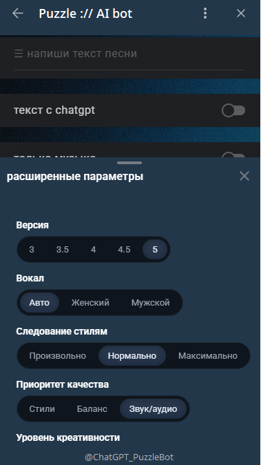
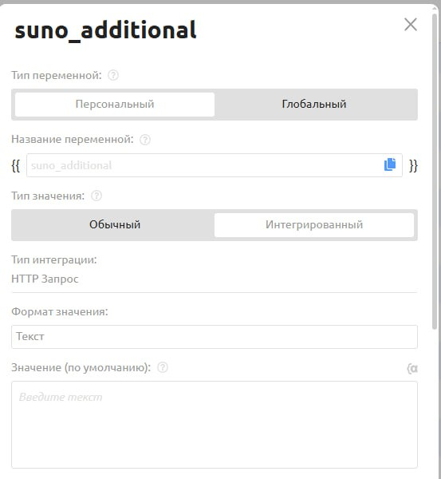

# Музыкальное приложение

С помощью данной инструкции вы сможете создать полнофункциональное мини-приложение для генерации музыки с помощью Suno в вашем Telegram-боте.&#x20;

**Ключевые возможности готового приложения:**

1. **Генерация в простом режиме.** Трек создается по короткому текстовому описанию (например, "создай лоу-фай бит про тихую библиотеку").
2. **Генерация в расширенном режиме.** Полная кастомизация трека, включая загрузку своего текста, выбор стиля, версии Suno, голоса вокалиста и других параметров.
3. **Режим кавера**. Возможность загрузить собственную аудиозапись для создания кавер-версии.

**Пример готового приложения:** [https://t.me/ChatGPT\_PuzzleBot?startapp=b2be1083b5699909](https://t.me/ChatGPT_PuzzleBot?startapp=b2be1083b5699909)

<figure><figcaption></figcaption></figure> <figure><figcaption></figcaption></figure> <figure><figcaption></figcaption></figure>


**Важная информация перед началом.** Процесс может занять несколько часов. Рекомендуем выделить достаточно времени, чтобы внимательно и без спешки пройти по всем шагам. В результате вы получите один из самых мощных инструментов для работы с музыкой, доступных на нашей платформе.


### Шаг 1. Подготовка. Создаем переменные

Мы создадим набор переменных, каждая из которых будет отвечать за свою часть информации (от текста песни до сообщений об ошибках).

1. В личном кабинете PuzzleBot выберите вашего бота и перейдите во вкладку "Переменные".

<figure><figcaption></figcaption></figure>

2. Создайте 10 новых персональных переменных:

<table><thead><tr><th width="192">Переменная</th><th width="170">Тип</th><th>Назначение</th></tr></thead><tbody><tr><td><code>suno_prompt</code></td><td>Текст</td><td>(Основной промпт) Главная переменная, которая будет хранить финальный текстовый запрос для отправки в Suno.</td></tr><tr><td><code>suno_styles</code></td><td>Текст</td><td>(Стили музыки) Хранит выбранные пользователем музыкальные стили (например, "pop", "rock", "lo-fi").</td></tr><tr><td><code>suno_mode</code></td><td>Текст (значение по умолчанию: "<code>simple</code>")</td><td>(Режим работы) Определяет, в каком режиме работает приложение — простом или расширенном.</td></tr><tr><td><code>suno_gpt_lyric</code></td><td>Текст (значение по умолчанию: "<code>false</code>"</td><td>(Текст от ChatGPT) Сюда будет записываться текст песни, сгенерированный с помощью ChatGPT.</td></tr><tr><td><code>suno_music_only</code></td><td>Текст (значение по умолчанию: "<code>false</code>")</td><td>(Только музыка) Используется как флаг (true или false), чтобы указать, нужно ли генерировать только инструментал, без вокала.</td></tr><tr><td><code>suno_additional</code></td><td>Интегрированный (Текст)</td><td>(Доп. параметры) Хранит расширенные настройки из кастомного режима (версия Suno, голос и т.д.).</td></tr><tr><td><code>suno_voice_upload</code></td><td>Текст</td><td>(Загруженный голос) Сюда будет записываться файл с голосом, который пользователь загрузит для кавера.</td></tr><tr><td><code>suno_cover</code></td><td>Текст</td><td>(Режим кавера) Переменная для хранения аудиофайла при создании кавера.</td></tr><tr><td><code>suno_error</code></td><td>Текст</td><td>(Сообщения об ошибках) Сюда можно записывать тексты ошибок для последующего отображения пользователю.</td></tr><tr><td><code>suno_extend</code></td><td>Текст</td><td>(Продление трека) Переменная для хранения аудиофайла при продлении трека</td></tr></tbody></table>


**Важно!** Переменная **`{{suno_additional}}`** - Интегрированная. \
\
Вот полные настройки:

* Тип значения: `Интегрированный`
* Тип интеграции: `HTTP Запрос`
* Формат значения: `Текст`
* Ссылка (JSON): `https://api.pxsto.re/main/99d25b4b-a540-41b2-a32b-e6b469610077`
* Ответ: result
* Тип запроса: GET
* Параметр\
  \- Ключ: user\_id\
  \- Значение: \{{USER\_ID\_TEXT\}}


<figure><figcaption></figcaption></figure> <figure><figcaption></figcaption></figure>

После того как все переменные будут созданы, можно переходить к следующему шагу - сборке интерфейса.

### Шаг 2. Создаем фундамент. Основные экраны приложения

#### 2.1. Создание мини-приложений

Прежде чем настраивать логику, нам нужно создать три "экрана" (в виде мини-приложений), между которыми будет переключаться пользователь.

1. **В PuzzleBot перейдите во вкладку "Конструктор" и создайте 4 новых мини-приложения.**&#x20;

 

2. **Дайте им любое произвольное название.**&#x20;

В нашем примере:&#x20;

* **Главный экран (`Suno Webapp`)**. Здесь пользователь будет выбирать между генерацией трека или модификациями.&#x20;
* **Переключатель режимов (`Suno :// формат трека`).** Дополнительная команда для работы со вкладками.&#x20;
* **Простой режим (`Suno :// создать просто`**). Экран для быстрой генерации трека по одной фразе.
* **Расширенный режим (`Suno :// создать кастомно`)**. Экран с полным набором настроек для продвинутых пользователей.
* **Модификации (`Suno :// меню модификаций`)**. Здесь пользователь сможет продлевать трек, разделять его на инструментал и вокал и т.д.

#### 2.2. Настройка главного экрана (`Suno Webapp`)

1. **Откройте мини-приложение `Suno Webapp`** и добавьте в него блок "Клавиатура".&#x20;

<figure><figcaption></figcaption></figure>

2. **Настройте первую кнопку** (как на изображении):

<figure><figcaption></figcaption></figure>

3. **Настройте вторую кнопку** (как на изображении):

<figure><figcaption></figcaption></figure>

4. В этом же мини-приложении откройте вкладку "Действия" и создайте поочередно 5 новых действий "**Очистить переменную**":

* `suno_gpt_lyric`
* `suno_styles`
* `suno_music_only`
* `suno_cover`
* `suno_mode`

<figure><figcaption></figcaption></figure>

#### 2.3. Переключатель режимов

1. **В мини-приложении "`Suno :// формат трека`" добавьте новый блок "Вкладки"** и настройте по аналогии:

<figure><figcaption></figcaption></figure>

<figure><figcaption></figcaption></figure>

#### **2.4. (**&#x41E;пционально) Копирование нашего дизайна&#x20;

Этот раздел поможет вам в точности воссоздать внешний вид нашего демонстрационного приложения. Все шаги в этом блоке необязательны и служат только для визуальной кастомизации.

* **Раскройте эту страницу** 👇

✨ КАК СКОПИРОВАТЬ ДИЗАЙН

**Важная подготовка. Настройка темы**

Наш фирменный дизайн рассчитан на определенные настройки отображения в Telegram. Для корректной работы всех элементов убедитесь, что у вас установлены правильные параметры.

1. В конструкторе PuzzleBot перейдите в "Настройки" вашего бота.
2. Откройте раздел "Мини-приложение".
3. Установите следующие значения:
   * Тема: `Темная`
   * Стиль: `Android`

<figure><figcaption></figcaption></figure>

1. **Добавление "бегущей строки":**

<figure><figcaption></figcaption></figure>

Создайте новое мини-приложение с любым названием, например "`html 1 (бегущая строка)`". Добавьте блок "HTML-код" и вставьте в него содержимое файла `бегущая строка.txt`&#x20;

\[[Ссылка на HTML-код](https://disk.yandex.ru/d/SjWaDYoVx2jSJg)]

<figure><figcaption></figcaption></figure>

Вернитесь в каждое из трех основных приложений ( "`Suno Webapp`", "`Suno :// создать просто`" и "`Suno :// создать кастомно`"). В каждом из них добавьте блок "Подстановка" и выберите созданное ранее приложение  "`html 1 (бегущая строка)`":

<figure><figcaption></figcaption></figure>

2. **Добавление анимированного стикера "Кот с маракасами"**

Этот забавный элемент оживляет главный экран.

<figure><figcaption></figcaption></figure>

1. Перейдите в главное мини-приложение `Suno Webapp`.
2. Добавьте в него поочередно три блока "Стикер".
3. В каждый из блоков загрузите по одному файлу: `1.tgs`, `2.tgs`, `3.tgs`. ([ссылка на файлы стикеров](https://disk.yandex.ru/d/5-h8O3h65kwlSw))

<figure><figcaption></figcaption></figure>

3. Установка фирменного фона и цвета шапки

Единый стиль для всех экранов делает приложение целостным и профессиональным.

> **Важно:** Эту настройку нужно будет применить для каждого мини-приложения, которое вы создаете в рамках этого руководства (изначально их три, но позже появятся и другие).

<figure><figcaption></figcaption></figure>

* Откройте мини-приложение (например, `Suno Webapp`).
* Перейдите в его дополнительные настройки.
* Установите галочку "Задать цвет шапки". Цвет шапки: `22374a`
* В поле «Фон» загрузите файл `background.mp4`. \[[Ссылка на файл с фоном](https://disk.yandex.ru/d/5-h8O3h65kwlSw)]
* Сохраните изменения и повторите эту процедуру для остальных мини-приложений.

<figure><figcaption></figcaption></figure>

Сохраните изменения и перейдите к следующему шагу.&#x20;

### Шаг 3. Настройка простого режима

На этом шаге мы соберём интерфейс экрана "простого режима". Цель — создать минималистичную форму, где пользователь сможет описать идею для трека, выбрать, нужна ли ему только музыка, и нажать кнопку для запуска генерации.

<figure><figcaption></figcaption></figure>

#### **3.1. Создание поля для ввода идеи трека**

&#x20;.png>)

Это основное текстовое поле, куда пользователь будет вводить свой запрос.

1. **В конструкторе PuzzleBot перейдите в мини-приложение "`Suno :// создать просто`".**&#x20;
2. **Создайте в нём новый блок "Форма ввода".**

<figure><figcaption></figcaption></figure>

3. **Заполните основные поля:**

* Тип ввода: "`Ввод текста`"
* Маска ввода: "`Текст`"&#x20;
* Тип поля ввода: "`Многострочный`"
* Плейсхолдер: "`✨ опиши идею для трека`"

<figure><figcaption></figcaption></figure>

4. **Настройте сохранение данных.**

* Раскройте "Дополнительные настройки". Установите все галочки и в поле "Дублировать ответ в переменную" укажите созданную ранее `suno_prompt`:

<figure><figcaption></figcaption></figure>

#### 3.2. Добавление переключателя "Только музыка"

<figure><figcaption></figcaption></figure>

Этот элемент позволит пользователю указать, что ему нужен только инструментал, без вокала.

1. **Добавьте в мини-приложение ещё один блок "Форма ввода"**. Заполните поля следующим образом:

* Тип ввода: `Выбор варианта`
* Количество ответов: `Один`
* Вид переключателей: `Тумблеры`&#x20;
* Вид кнопки: `Только текст`
* Название кнопки: "`только музыка`" (произвольное)

<figure><figcaption></figcaption></figure>

2. **Раскройте дополнительные настройки кнопки.** Установите галочку напротив пункта "Изменить переменную". Укажите название переменной `suno_music_only` с выражением `"true"`.

<figure><figcaption></figcaption></figure>

<figure><figcaption></figcaption></figure>

#### **3.3. Настройка кнопки генерации**

Теперь добавим главную кнопку, которая будет запускать процесс создания трека.

1. **Создайте новую команду**. В основном конструкторе (не в мини-приложениях) создайте новую обычную команду и назовите её `suno_tracker`

<figure><figcaption></figcaption></figure>

Оставьте её пустой. Она нужна нам как временная цель для кнопки. Полноценную логику мы добавим в неё на финальном этапе

2. **Настройте клавиатуру:**

* Вернитесь в мини-приложение `Suno :// создать просто` и измените блок "Клавиатура".
*   Настройте кнопку, как показано на изображении ниже, привязав к ней команду

    `suno_tracker`

<figure><figcaption></figcaption></figure>

3. Раскройте дополнительные настройки клавиатуры. Установите галочки напротив пунктов "Закрыть Мини-приложение" и "Изменить переменную". Укажите переменную `suno_mode` и выражение `"simple"`

<figure><figcaption></figcaption></figure>

Сохраните изменения и переходите к следующему шагу.

#### **3.4. (**&#x41E;пционально) Копирование нашего дизайна&#x20;

* **Раскройте эту страницу** 👇

 КАК СКОПИРОВАТЬ ДИЗАЙН

* **Добавьте бегущую строку**, которую мы сделали в Шаге 2, путем добавления блока "Подстановка". Переместите этот блок на первую позицию:

<figure><figcaption></figcaption></figure>

* **Добавьте новый блок "Описание"**, после "Текст с музыкой", чтобы получилось так:

<figure><figcaption></figcaption></figure>

<figure><figcaption></figcaption></figure>

### Шаг 4. Настройка расширенного режима

На этом шаге мы создадим многофункциональную страницу для "расширенного режима", которая даёт полный контроль над генерацией.

<figure><figcaption></figcaption></figure>

#### **4.1. Поле для ввода текста песни**

&#x20;.png>)

Это поле позволит пользователям вставлять свой собственный текст для песни.

1. Перейдите в мини-приложение `Suno :// создать кастомно`. Создайте в нём новый блок "Форма ввода".
2. Заполните основные поля:

* Название для статистики: `suno_lyrics`
* Переменная: `suno_lyrics`
* Тип ввода: `Ввод текста`
* Маска ввода: `Текст`
* Тип поля ввода: `Многострочный`
* Ограничить количество символов: `2000`
* Плейсхолдер: `напиши текст песни` (произвольное)

<figure><figcaption></figcaption></figure>

3. **Раскройте дополнительные настройки формы ввода**. Установите все галочки и настройте дублирование в переменную `suno_prompt,` как показано на скриншоте:

<figure><figcaption></figcaption></figure>

#### 4.2. Переключатель "Сочинить текст"

&#x20;

Этот переключатель добавляет в ваше приложение мощную функцию: возможность генерировать текст песни на ходу с помощью ChatGPT. Пользователю не придется придумывать текст самому, достаточно будет просто описать идею, и нейросеть сделает это за него.

1. **В мини-приложении `Suno :// создать кастомно` создайте ещё один блок "Форма ввода".** Заполните основные поля:

* Тип ввода: `Выбор варианта`
* Количество ответов: `Один`
* Вид переключателей: `Тумблеры`
* Вид кнопки: `Только текст`
* Название кнопки: "`сочинить текст`" (произвольное)

<figure><figcaption></figcaption></figure>

3. **Раскройте дополнительные настройки кнопки.** Установите галочку напротив пункта "Изменить переменную". Укажите переменную `suno_gpt_lyric` с выражением `"true"`

<figure><figcaption></figcaption></figure>

#### 4.3. Переключатель "Только музыка"

<figure><figcaption></figcaption></figure>

Теперь добавим переключатель для создания инструментальных треков. Настройка этого элемента полностью аналогична шагу в "простом режиме".

1. **Добавьте новый блок "Форма ввода" в то же мини-приложение.** Заполните основные поля:

* Тип ввода: `Выбор варианта`
* Количество ответов: `Один`
* Вид переключателей: `Тумблеры`
* Вид кнопки: `Только текст`
* Название кнопки: "`только музыка`" (произвольное)

<figure><figcaption></figcaption></figure>

2. **Раскройте дополнительные настройки кнопки.** Установите галочку напротив пункта "Изменить переменную". Укажите название переменной `suno_music_only` с выражением `"true"`.

<figure><figcaption></figcaption></figure>

<figure><figcaption></figcaption></figure>

#### 4.4. Выбор стилей (опционально, требует NocoDB)

Этот блок позволит пользователям выбирать до 7 музыкальных стилей из готового списка.

<mark style="background-color:$warning;">**Важно: Пропустите этот шаг, если у вашего бота нет интеграции с NocoDB**</mark>

1. **Загрузите данные в NocoDB:**

* Скачайте CSV-файл со списком стилей по этой ссылке: [https://disk.yandex.ru/d/9zeSHRWNyOKTqw](https://disk.yandex.ru/d/9zeSHRWNyOKTqw)&#x20;
* В вашей базе NocoDB нажмите "Import Data"

<figure><figcaption></figcaption></figure>

* Выберите формат "**CSV**", загрузите скачанный файл и подтвердите импорт.

<figure><figcaption></figcaption></figure>

2. **Настройте блок в PuzzleBot:**

* Вернитесь в мини-приложение `Suno :// создать кастомно` и создайте новый блок "Форма ввода"
* Заполните поля:
* **Название для статистики:** `suno_styles_all`
* **Переменная:** `suno_styles_all`
* **Тип ввода:** `Список`
* **Количество ответов:** `Несколько`
* **Ограничить количество вариантов:** `от 0 до 7`
* **Способ записи значения:** `Значения через запятую`
* **Источник списка:** `Подключить NocoDB`

<figure><figcaption></figcaption></figure>

**Выберите вашу БД**, подгрузите таблицу из NocoDB и заполните поля:

* Столбец с названием варианта: `title`
* Столбец с названием варианта: `description`

<figure><figcaption></figcaption></figure>

**В настройках "Клавиатуры"** этого блока установите галочку напротив "Дублировать ответ в переменную" и введите переменную `suno_styles`:

<figure><figcaption></figcaption></figure>

#### 4.5. Блок расширенных настроек

<figure><figcaption></figcaption></figure>

Этот блок, реализованный через HTML, будет содержать все остальные кастомные параметры (выбор версии, голоса и т.д.).

1. Создайте мини-приложение для HTML-кода:

* Создайте новое мини-приложение с произвольным названием, например, "`html 2 (доп. параметры)`".&#x20;
* Добавьте в него блок "HTML-код" и вставьте в него код [из этого файла](https://disk.yandex.ru/d/TaTV1mVYktZuwg)

<figure><figcaption></figcaption></figure>

2. **Настройте кнопку и клавиатуру в основном приложении:**

Вернитесь к мини-приложению "`Suno :// создать кастомно`". Добавьте новый блок "Клавиатура" и заполните поля:

* **Тип клавиатуры:** `Обычная`
* **Название:** `расширенные настройки` (произвольное)

<figure><figcaption></figcaption></figure>

Настройте кнопку и сам блок клавиатуры, как показано в примере:

<figure><figcaption></figcaption></figure>

Сохраните изменения и переходите к следующему шагу.&#x20;

### Шаг 5. Настройка режима создания кавера

На этом шаге мы уделим внимание кнопке "**Загрузить аудио**" для создания каверов. Полный функционал включает не только загрузку готовых файлов, но и запись голосовых сообщений прямо в боте.

<figure><figcaption></figcaption></figure>

#### 5.1. Создание экрана для загрузки

1. **Создайте новое мини-приложение** с произвольным названием, например "`Suno :// создать кавер`".&#x20;
2. **Добавьте в это приложение два блока "Заголовок" и "Описание".** Заполните их текстом, который объяснит пользователю, что нужно сделать. Например:

* **Заголовок:** "`кавер-версия`"&#x20;
* **Описание:** "`для создания кавер-версии трека загрузи собственный аудиотрек или запиши голосовое сообщение`".  &#x20;

<figure><figcaption></figcaption></figure>

#### 5.2. Настройка формы для загрузки файла

Это ключевой элемент экрана, который позволит пользователю загрузить свой аудиофайл.

1. Добавьте в это же мини-приложение новый блок "Форма ввода".
2. Заполните поля:

* **Название для статистики**: `suno_upload_audio`
* **Переменная**: `suno_upload_audio`
* **Тип ввода**: `Загрузка файла`
* **Количество файлов:** `1`
* **Ошибка (превышено количество)**: `Превышено максимальное количество файлов`
* **Маска ввода**: `Аудио`
* **Ошибка (маска ввода)**: `Недопустимый формат файла`

<figure><figcaption></figcaption></figure>

3. **Раскройте "Дополнительные настройки".** Поставьте галочку напротив "Дублировать ответ в переменную" и укажите пользовательскую переменную `suno_cover`. Это действие сохранит загруженный файл в нужную переменную для дальнейшей обработки.

<figure><figcaption></figcaption></figure>

#### 5.3. Создание команды для записи голосового сообщения

**Зачем нужна отдельная команда?** Запись голоса — это стандартная функция Telegram, которая временно выводит пользователя из интерфейса мини-приложения. Поэтому мы создадим отдельную команду, которая будет ловить его ответ.

1. **Создайте новую обычную команду.** Дайте ей любое название, например "`Suno :// записать голосовое`".

<figure><figcaption></figcaption></figure>

2. Добавьте в эту команду новый блок "Форма ввода" и заполните поля:

* **Текст:** "`запиши и отправь мне голосовое сообщение`"&#x20;
* **Название для статистики:** `suno_upload_voice`
* **Переменная:** `suno_upload_voice2`
* **Тип ввода:** `Отправка сообщения`
* **Варианты для выбора:** `Один`
* **Маска ввода:** `Голосовая запись`

<figure><figcaption></figcaption></figure>

3. **Раскройте "Дополнительные настройки".** Установите галочку напротив пункта "Дублировать ответ в переменную" и укажите пользовательскую переменную `suno_cover`:

<figure><figcaption></figcaption></figure>

4. **Откройте вкладку "Действия".** Во вкладке "Действия" этой же команды добавьте действие "Отправить команду или условие" и выберите `suno_tracker:`

<figure><figcaption></figcaption></figure>

#### 5.4. Добавление кнопок на экран кавера

Теперь вернитесь в мини-приложение "`Suno :// создать кавер`" и добавим в него две кнопки.

1. **Настройте кнопку "Записать голос":**

Добавьте новый блок "Клавиатура". Дайте кнопке любое название, например "`записать голос`" и установите тип клавиатуры "Обычная".

<figure><figcaption></figcaption></figure>

Настройте кнопку так, как показано на скриншоте:

<figure><figcaption></figcaption></figure>

**Раскройте "Дополнительные настройки".** Здесь заложена основная функция перехода в Телеграм-бот для записи голосового сообщения. Установите галочку "Показать попап" и заполните основные поля:

* **Тип:** `С кнопкой`
* **Добавить заголовок:** `Да` (поставить галочку)
* **Заголовок:** "`запись голосового сообщения`"
* **Текст:** "`вы будете направлены в бот для записи голосового сообщения`"
* **Название кнопки:** `ОК`

<figure><figcaption></figcaption></figure>

Нажмите на созданную кнопку "ОК" и раскройте дополнительные настройки.&#x20;

* Установите действие кнопки: "Переход к команде или условию" -> "`Suno :// записать голосовое`".&#x20;
* В дополнительных настройках установите галочки напротив пунктов "Закрыть Мини-приложение" и "Выполнить вибрацию".&#x20;

<figure><figcaption></figcaption></figure>

2. **Настройте кнопку "Создать трек**".&#x20;

&#x20;Это финальный штрих в мини-приложении "`Suno :// Создать кавер`".&#x20;

* Найдите уже созданный автоматически блок "Клавиатура" (с фиксированным типом) и измените кнопку по аналогии:

<figure><figcaption></figcaption></figure>

<figure><figcaption></figcaption></figure>

**Раскройте "Дополнительные настройки" клавиатуры.** Установите галочки напротив пунктов "Закрыть Мини-приложение" и "Изменить переменную". Укажите переменную `suno_mode` и выражение "`custom"`

<figure><figcaption></figcaption></figure>

#### 5.5. Добавление кнопки "Загрузить аудио"

Финальный штрих — добавим кнопку для перехода в созданный нами режим кавера с экрана расширенных настроек.

1. **Вернитесь в мини-приложение `"Suno :// Создать кастомно`".**&#x20;

Найдите автоматически созданную клавиатуру с типом "Фиксированная". Добавьте в неё две кнопки "загрузить аудио" и "создать трек":

<figure><figcaption></figcaption></figure>

* **Настройте кнопку "загрузить аудио".** Установите действие кнопки: "Переход к Мини-приложению" -> "`Suno :// создать кавер`".

<figure><figcaption></figcaption></figure>

* **Настройте кнопку "создать трек".** Установите действие кнопки: "Переход к команде или условию" -> "`suno_tracker`":

<figure><figcaption></figcaption></figure>

* **Раскройте дополнительные настройки для кнопки "создать трек".** Установите галочку напротив "Изменить переменную" и добавьте `suno_mode` с выражением "`custom`"

<figure><figcaption></figcaption></figure>

После сохранения изменений все экраны будут связаны между собой.

### Шаг 6. Добавляем модификации

На момент написания инструкции доступно 2 модификации: продление трека и разделение трека на вокал и инструментал

<figure><figcaption></figcaption></figure>

#### 6.1. Подготовка и основной экран

В этом блоке мы будем заполнять основной экран "`Suno :// меню модификаций`", а также создадим команды для перехода к функциям.

1. Создайте два новых мини-приложения:

* **Продление трека (`Suno :// продлить трек`)**. Здесь пользователь загружает аудиофайл для продления трека.
* **Разделение трека (`Suno :// разделить трек`).** Здесь пользователь загружает аудиофайл для разделения трека.

<figure><figcaption></figcaption></figure>

2. **В мини-приложении `Suno :// меню модификаций` создайте два новых блока "Заголовок" и "Текст"**. Заполните по аналогии:

<figure><figcaption></figcaption></figure>

3. **Добавьте новый блок "Клавиатура" с типом "Обычная"**. Создайте две кнопки "продлить трек" и "отделить вокал" и соедините их с мини-приложениями `Suno :// продлить трек` и `Suno :// разделить трек` соответственно:

<figure><figcaption></figcaption></figure>

#### 6.2. Продление трека

1. **Продублируйте мини-приложение "`Suno :// создать кастомно`"**. Назовите дублированное мини-приложение "`Suno :// продлить`" (или любое другое).

<figure><figcaption></figcaption></figure>

Единственное, что нужно изменить в продублированном мини-приложении - это кнопка "Создать трек" заменяется на "Продолжить", чтобы перенаправить пользователя на загрузку аудио и новое мини-приложение "`Suno :// продлить трек`"

<figure><figcaption></figcaption></figure>

<figure><figcaption></figcaption></figure>

2. **В приложении "`Suno :// продлить трек`" добавьте два блока "Заголовок" и "Текст"** и заполните по аналогии (см. скриншот):

<figure><figcaption></figcaption></figure>

3. **Добавьте блок "Форма ввода"** для загрузки аудиофайла. Заполните поля:

* Тип ввода: `Загрузка файла`
* Количество файлов: `1`
* Маска ввода: `Аудио`
* Название кнопки: "`загрузить аудио`"

<figure><figcaption></figcaption></figure>

Раскройте дополнительные настройки формы ввода. Поставьте галочку напротив "Дублировать ответ в переменную" и укажите пользовательскую переменную `suno_cover`. Это действие сохранит загруженный файл в нужную переменную для дальнейшей обработки.

<figure><figcaption></figcaption></figure>

4. **Создайте новый блок "Форма ввода"**. Заполните основные поля:

* Тип ввода: `Выбор времени`
* Задать интервал: с `00:01` по `00:00`

<figure><figcaption></figcaption></figure>

Раскройте дополнительные настройки формы ввода. Установите галочку напротив пункта "Дублировать ответ в переменную" и укажите переменную `suno_extend`. Разрешите повторное прохождение.

<figure><figcaption></figcaption></figure>

5. **Создайте новый блок "Клавиатура" с типом "Фиксированная"**. Настройте по аналогии:

<figure><figcaption></figcaption></figure>

Раскройте дополнительные настройки кнопки. Установите галочки напротив пунктов "Закрыть Мини-приложение" и "Изменить переменную". Установите переменную `suno_mode` и значение `"extend"`:

<figure><figcaption></figcaption></figure>

#### 6.2. Разделение трека

1. В приложении "`Suno :// разделить трек`" добавьте два новых блока "Заголовок" и "Текст" и заполните по аналогии:

<figure><figcaption></figcaption></figure>

2. **Добавьте новый блок "Форма ввода"**. Заполните основные поля:

* Тип ввода: `Загрузка файла`
* Количество файлов: `1`
* Маска ввода: `Аудио`
* Название кнопки: "`загрузить аудио`"

<figure><figcaption></figcaption></figure>

3. **Создайте новый блок "Клавиатура" с типом "Фиксированная"**. Настройте по аналогии:

<figure><figcaption></figcaption></figure>

* Раскройте дополнительные настройки кнопки. Установите галочки напротив пунктов "Закрыть Мини-приложение" и "Изменить переменную". Установите переменную `suno_mode` и значение `"separate"`:

<figure><figcaption></figcaption></figure>

### Шаг 7. Финал. Настраиваем отправку запроса

Мы подошли к финальному и ключевому шагу. Сейчас мы настроим команду `suno_tracker`, которую мы создавали как "заглушку" на предыдущих этапах. Эта команда собирает всю информацию из переменных и отправляет единый запрос в систему Puzzle AI для начала генерации.

#### 7.1. Настройка основного запроса (Tracker)

1. В конструкторе PuzzleBot откройте команду `suno_tracker`
2. Перейдите на вкладку "Действия" и добавьте действие "Отправить запрос".&#x20;
3. Заполните основные поля запроса:

* **Ссылка:** `https://api.pxsto.re/main/puzzlebot-tracker`
* **Установите тип запроса:** `POST`
* **Вид запроса:** `Сформированный`

<figure><figcaption></figcaption></figure>

4. **Добавьте 12 параметров**. Эти параметры передают в Puzzle AI всю необходимую информацию для генерации.

* Ключ: `user` \
  Значение: `{{USER_ID_TEXT}}`
* Ключ: `model` \
  Значение: `suno`
* Ключ: `bot` \
  Значение: `{{BOT_USERNAME_TEXT}}`
* Ключ: `token` \
  Значение: <mark style="background-color:$warning;">\[Укажите ваш API-токен]</mark>
* Ключ: `prompt` \
  Значение: `{{suno_prompt}}`
* Ключ: `instrumental` \
  Значение: `{{suno_music_only}}`
* Ключ: `styles` \
  Значение: `{{suno_styles}}`
* Ключ: `mode` \
  Значение: `{{suno_mode}}`
* Ключ: `gpt_lyric` \
  Значение: `{{suno_gpt_lyric}}`
* Ключ: `additional` \
  Значение: `{{suno_additional}}`
* Ключ: `gpt_tags_edit`\
  Значение: `true`
* Ключ: `extend`\
  Значение: `{{suno_extend}}`

<figure><figcaption></figcaption></figure>

#### 7.2. Очистка переменных после запроса

**Зачем это нужно?** После того как запрос на генерацию отправлен, необходимо очистить переменные. Это гарантирует, что настройки от предыдущего трека не повлияют на следующий.

1. В этой же команде `suno_tracker`, после действия "Отправить запрос", добавьте несколько действий "Очистить переменную".
2. Последовательно очистите следующие переменные:

* `suno_styles`
* `suno_music_only`
* `suno_gpt_lyric`
* `suno_cover`
* `suno_mode`

#### **7.3. Создание команды для обработки ошибок**

1. Создайте новую инлайн-команду и назовите её `suno_error`.
2. Добавьте новый блок "Текст". Введите текст с сообщением об ошибке и укажите переменную `{{suno_error}}`

<figure><figcaption></figcaption></figure>

#### Поздравляем!

Вы завершили сборку мини-приложения Suno. Теперь у вашего бота есть мощный инструмент для создания музыки, который вы можете дальше кастомизировать и улучшать.

**Остались вопросы?** Напишите в поддержку: [https://t.me/FreeAIchat/199018](https://t.me/FreeAIchat/199018)
