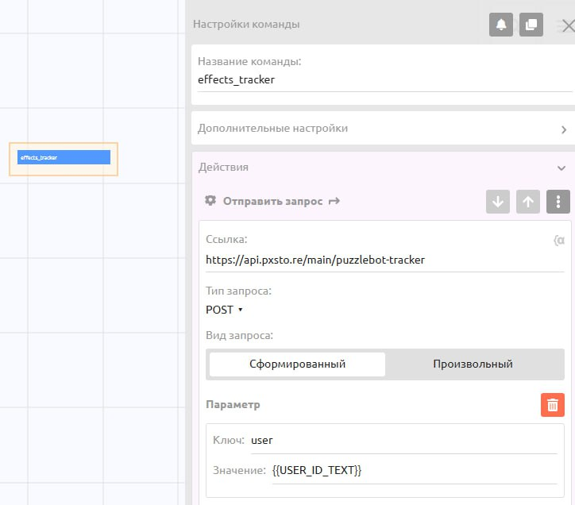
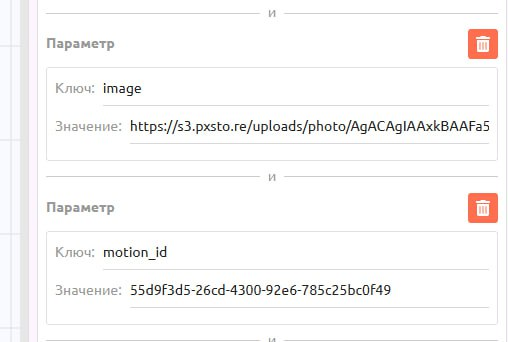

# Видеоэффекты (VFX)



Режим **«Видеоэффекты (VFX)**» нужен, когда вы хотите превратить обычное фото пользователя в короткую зрелищную анимацию — без сложных настроек и ручной работы с промптами.

Логика работы для пользователя максимально простая:

1. Пользователь **загружает фото** (чаще всего себя или объект в кадре).
2. **Выбирает готовый шаблон эффекта**
3. Через несколько секунд **получает видео**, где к его фото применён выбранный эффект.

Вы не описываете, как должна двигаться камера или выглядеть огонь (всё уже настроено). Ваша задача как разработчика только дать пользователю выбрать нужный шаблон и передать его через трекер.

Сейчас доступно **более 177 шаблонов видеоэффектов**, и этот список регулярно пополняется. Их можно использовать для:

* клипов и вертикальных видео (Reels, Shorts, TikTok);
* промо-роликов и рекламных вставок;
* эффектных переходов между сценами;
* «вау-эффекта» в развлекательных ботах.

**Пример готового приложения на этих эффектах:** [**https://t.me/volshebhy\_bot?startapp=9f5c735fbe5f7a9b**](https://t.me/volshebhy_bot?startapp=9f5c735fbe5f7a9b)

<div><figure><figcaption></figcaption></figure> <figure><figcaption></figcaption></figure></div>

***

### Настройка запроса (Tracker)

<figure><figcaption></figcaption></figure>

В любой команде вашего бота (например, `effects_tracker`) добавьте действие **«Отправить запрос»** и настройте его  следующим образом:

* Ссылка: `https://api.pxsto.re/main/puzzlebot-tracker`
* Тип запроса: `POST`
* Вид запроса: `Сформированный`

Нажмите кнопку «Добавить параметр» и добавьте все ключи из таблицы ниже.

#### Параметры запроса

Все параметры являются обязательными (кроме `send_answer`, если он не нужен).

<table data-header-hidden><thead><tr><th></th><th></th><th width="296"></th><th align="center"></th></tr></thead><tbody><tr><td><strong>Ключ (Параметр)</strong></td><td><strong>Значение / Пример</strong></td><td><strong>Описание</strong></td><td align="center">Обязательно?</td></tr><tr><td>user</td><td><code>{{USER_ID_TEXT}}</code></td><td>ID пользователя, который запускает команду.</td><td align="center">Да</td></tr><tr><td>bot</td><td><code>{{BOT_USERNAME_TEXT}}</code></td><td>Username вашего бота</td><td align="center">Да</td></tr><tr><td>token</td><td><code>[Ваш API-токен]</code></td><td>Ваш API-токен из настроек интеграции Puzzle AI.</td><td align="center">Да</td></tr><tr><td>model</td><td><code>effects</code></td><td>Модель для видеоэффектов</td><td align="center">Да</td></tr><tr><td>image</td><td><code>{{photo_var}}</code></td><td>Переменная, содержащая File ID или URL изображения, к которому нужно применить эффект.</td><td align="center">Да</td></tr><tr><td>motion_id</td><td><code>fdc223d4-940...</code></td><td>Уникальный ID эффекта (см. раздел "Где взять ID").</td><td align="center">Да</td></tr><tr><td>send_answer</td><td><code>true</code> или <code>false</code></td><td><p><code>true</code> Бот сам пришлет готовое видео.</p><p><br></p><p><code>false</code> Бот запишет результат в переменную (без отправки).</p></td><td align="center">Нет</td></tr><tr><td><code>chat</code></td><td><code>-1001882765759</code> (Пример)</td><td>ID группового чата или форума для отправки запроса</td><td align="center">Нет</td></tr><tr><td><code>topic</code></td><td><code>123</code> (Пример)</td><td>ID определенного топика форума</td><td align="center">Нет</td></tr></tbody></table>

***

### Где взять список эффектов (`motion_id`)?

<figure><figcaption></figcaption></figure>

Поскольку эффекты могут обновляться, разработчикам предоставляется API для получения актуального списка. Вы можете использовать эти данные для создания динамического меню в WebApp или просто выбрать нужные ID вручную.

#### 1. Получить список всех эффектов:

* URL: `https://api.pxsto.re/main/get_motions_list`
* Метод: `GET`

В ответе придет JSON-список. Вам нужно поле motion\_id для трекера.

Пример структуры эффекта:

```
{
  "label": "Поджог",
  "motion_id": "fdc223d4-9402-47c6-9e07-5801985b450e",
  "description": "The subject bursts into flames...",
  "video_url": "https://.../preview.webp",
  "tags": ["vfx", "new"],
  "priority": true,
  "disabled": false
}
```

Для трекера обязательно только поле **`motion_id`**. Остальные поля (`label`, `description`, `video_url`, `tags`, `priority`, `disabled`) можно использовать для интерфейса: названия, описания, превью и фильтрация по тегам.

#### 2. Получить историю эффектов пользователей:

* URL: `https://api.pxsto.re/main/get_motions`
* **Метод:** `GET`

Эндпоинт возвращает историю последних применённых эффектов. Его можно использовать для:

* истории запросов пользователя;
* раздела "Недавние эффекты";
* собственной аналитики по пользователям.

***

### Практический пример. Создаем бота с эффектом "Поджог"

**Задача:** пользователь загружает фото, а бот возвращает видео, где этот объект сгорает в огне.

#### Шаг 1. Загрузка фото пользователя

<figure><figcaption></figcaption></figure>

Создайте команду (например, `/fire_effect`). Добавьте в неё "Форму ввода":

* Текст: `Загрузи фото, и я устрою пожар`.
* Тип ввода: `Отправка сообщения`
* Маска ввода: `Изображение`
* Переменная: `{{photo_var}}`

Так вы сохраните фото пользователя в переменную `{{photo_var}}`.

#### Шаг 2. Отправка запроса

Сразу после формы переводите пользователя на вашу команду с трекером (`vfx_tracker`).

Заполняем параметры:

* user: `{{USER_ID_TEXT}}`
* bot: `{{BOT_USERNAME_TEXT}}`
* token: `ВАШ_ТОКЕН`
* image: `{{user_photo}}`
*   motion\_id: fdc223d4-9402-47c6-9e07-5801985b450e

    (Это ID эффекта "Поджог", взятый из списка `get_motions_list`.)

#### Шаг 3. Получение результата

<figure><figcaption></figcaption></figure>

Вам обязательно нужно создать в боте отдельную команду с названием: `effects_done`

Когда видео будет готово, система сама запустит эту команду для пользователя.

***

### Мини-приложение. Рекомендации для разработчиков

Чтобы ускорить вашу разработку, мы подготовили готовый HTML-шаблон для мини-приложения. Это стильный и адаптивный интерфейс с поддержкой категорий, поиска, истории и предпросмотра видео (мы давали ссылку на него в начале этой статьи).

**Скачать HTML-шаблон:**


**Внимание:** Этот код не будет работать, если у вас нет своего сервера (или сценария автоматизации) для обработки запроса и отправки обратного API-запроса к вашему боту в PuzzleBot.


Этот шаблон отвечает только за визуальную часть: он отображает карточки, проигрывает видео и реагирует на нажатия. Сам по себе этот файл не умеет создавать задачи на генерацию или управлять ботом.

**Процесс выглядит так:**

1. Пользователь нажимает кнопку «Создать» в приложении.
2. Приложение собирает данные (какой эффект выбран и кто его выбрал) и отправляет их по ссылке, которую вы укажете в коде.
3. По этой ссылке должен находиться ваш вебхук. Он принимает эти данные и отправляет API-запрос в PuzzleBot.
4. Только после получения этого API-запроса PuzzleBot запускает генерацию видео и отправляет результат пользователю.

Если вы просто вставите код в бота, но не настроите прием данных на сервере, нажатие на кнопку «Создать» не приведет к результату, так как данные уйдут в пустоту.

**Инструкция по установке**

1. **Возьмите HTML-код** и вставьте его в настройки вашего WebApp.
2. **Настройте вебхук (обязательно)**.  В коде есть место, куда будут отправляться данные.
   * Найдите строку \~1448: `fetch('YOUR_WEBHOOK_URL', { ...`
   * Замените `YOUR_WEBHOOK_URL` на ссылку вашего сценария (Webhook URL).

<figure><figcaption></figcaption></figure>

3. **Настройка данных (интегрированные переменные).** Чтобы не переписывать HTML-код каждый раз, когда появляется новый эффект, используйте Интегрированные переменные. Это позволит боту автоматически подтягивать актуальный список эффектов и личную историю пользователя.

<figure><figcaption></figcaption></figure>

**Как настроить переменные:**&#x20;

Зайдите в конструкторе в раздел **Переменные** -> и создайте две переменные с типом "Интегрированный". Их названия должны точно совпадать с теми, что используются в HTML-коде (`motions_list` и `effects_history`).

1. **Переменная для списка эффектов** (`motions_list`)**.** Эта переменная загружает витрину.

* Ссылка (URL): `https://api.pxsto.re/main/get_motions_list`.
* Тип запроса: GET.

<figure><figcaption></figcaption></figure>

2. **Переменная для истории** (`effects_history`). Эта переменная загружает последние сгенерированные видео конкретного человека.

* Ссылка (URL): `https://api.pxsto.re/main/get_motions`
* Параметр (Важно!): Обязательно добавьте параметр `user_id` со значением `{{USER_ID_TEXT}}`. Без этого параметра WebApp не поймет, чью именно историю нужно показать.

<figure><figcaption></figcaption></figure>

Вы можете управлять отображением эффектов прямо в JSON-ответе вашего сервера, используя специальные параметры:

* `priority: true` — эффект автоматически поднимется в самый верх списка (в топ ленты).
* `disabled: true` — эффект будет скрыт из приложения (полезно для техобслуживания или отключения старых версий).

Важно: Никогда не вставляйте в код свои API-ключи (PuzzleAI, Telegram Bot API, NocoDB и т.д.). Все секретные ключи и проверки баланса должны находиться на стороне вашего сервера (в сценарии обработки), который скрыт от глаз пользователя.

***

С такой конфигурацией вы сможете быстро собрать как простой бот "один эффект по кнопке", так и полноценное мини-приложение.

