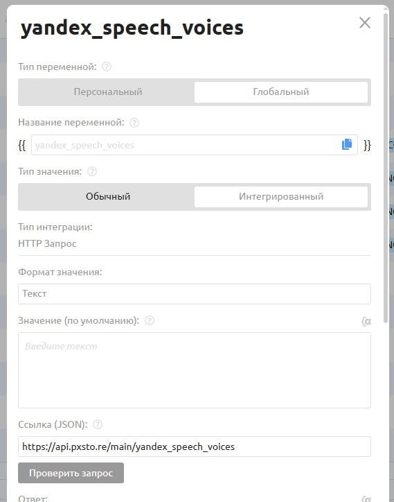
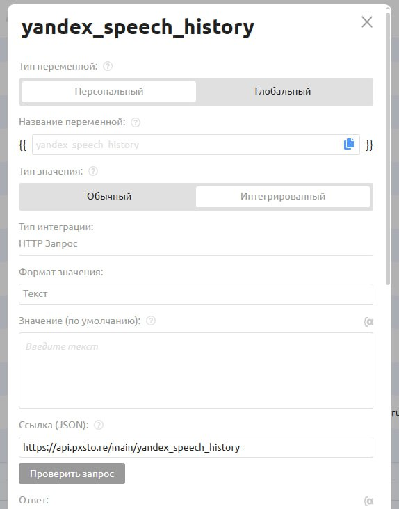

# Яндекс Спич

Этот инструмент позволяет превращать текст в голосовые сообщения (OGG) или аудиофайлы (MP3), используя технологии Yandex SpeechKit.

**Основные возможности:**

* **5 языков:** русский, казахский, узбекский, английский, немецкий.
* **13 голосов:** мужские и женские голоса на выбор.
* **Настройка эмоций и скорости озвучки**

Есть несколько способов использования TTS: через быструю команду (`/tts)`,  мини-приложение c гибкими настройками (Mini App) или форму ввода.

***

### Способ 1: быстрая команда

Самый простой способ, не требующий настройки параметров. Пользователь отправляет боту команду `/tts` и текст для озвучки.&#x20;

**Пример сообщения боту:**

> /tts Привет, это пример вашей озвучки!

<figure><figcaption></figcaption></figure>

**Важно:** Выбор голоса в данном случае не возможен, по умолчанию выбирается голос Алёна с эмоцией Радость, скорость 1х

***

### Способ 2: мини-приложение (рекомендуем)

Данный способ дает пользователю полный контроль: выбор голоса, эмоции, скорости и формата файла (ogg/mp3) через удобное приложение.

<figure><figcaption></figcaption></figure>

Вот инструкция как создать мини-приложение с нуля.

#### Шаг 1. Создание переменных

Для работы меню выбора необходимо создать **3 переменные**: одну обычную и две интегрированные.&#x20;

**1) Переменная для хранения текста:**

* Название: `speech` (произвольное)&#x20;
* Тип переменной: Персональный
* Тип значения: Обычный

<figure><figcaption></figcaption></figure>

**2) Переменная для списка голосов:**

* Название: `yandex_speech_voices`&#x20;
* Тип переменной: Глобальный
* Тип значения: Интегрированный (Текст)
* Ссылка (JSON): `https://api.pxsto.re/main/yandex_speech_voices`
* Тип запроса: `GET` &#x20;


Название должны быть строго таким, как указано выше


<figure><figcaption></figcaption></figure> <figure><figcaption></figcaption></figure>

**3) Переменная для истории выбора:**

* Название: `yandex_speech_history`
* Тип переменной: Персональный
* Тип значения: Интегрированный (Текст)
* Ссылка (JSON): `https://api.pxsto.re/main/yandex_speech_history`
* Тип запроса: `GET`
* Добавьте параметр `user_id` со значением `{{USER_ID_TEXT}}`.


Название должны быть строго таким, как указано выше


<figure><figcaption></figcaption></figure> <figure><figcaption></figcaption></figure>

#### Шаг 2. Настройка мини-приложения

1. Скачайте файл с HTML-кодом: 📄 Скачать index.html
2. Создайте новое "Мини-приложение" в конструкторе (название произвольное).
3. Внутри мини-приложения добавьте блок "HTML-код" и вставьте содержимое файла в поле.

<figure><figcaption></figcaption></figure>

4. В этом же мини-приложении добавьте новый блок "Форма ввода", куда пользователь будет вводить текст для озвучки.

* Тип ввода: Ввод текста
* Маска ввода: Текст
* Тип поля ввода: Многострочный
* Дополнительные настройки: Дублировать ответ в переменную `speech`, которую мы создали на Шаге 1)

<figure><figcaption></figcaption></figure>

5. Создайте обычную команду (например, `yandex_speech_tracker`). Настройте клавиатуру так, чтобы мини-приложение вело на эту команду.

<figure><figcaption></figcaption></figure>

#### Шаг 3. Настройка трекера

В команде `yandex_speech_tracker,` на которую ведет мини-приложение, добавьте новое действие "Отправить запрос".

* Ссылка: `https://api.pxsto.re/main/puzzlebot-tracker`
* Тип запроса: `POST`
* Вид запроса: `Сформированный`   &#x20;

<figure><figcaption></figcaption></figure>

Добавьте параметры из таблицы ниже.

**Параметры:**

| Ключ     | Значение                  | Описание                                           | Обязательно? |
| -------- | ------------------------- | -------------------------------------------------- | ------------ |
| `user`   | `{{USER_ID_TEXT}}`        | ID пользователя.                                   | Да           |
| `bot`    | `{{BOT_USERNAME_TEXT}}`   | Юзернейм бота                                      | Да           |
| `token`  | `Ваш API токен`           | API-токен из настроек интеграции                   | Да           |
| `model`  | `tts`                     | Модель для озвучки текста                          | Да           |
| `prompt` | `{{speech}}`              | Переменная с текстом для озвучки                   | Да           |
| `chat`   | `-1001882765759` (Пример) | ID группового чата или форума для отправки запроса | Нет          |
| `topic`  | `123` (Пример)            | ID определенного топика форума                     | Нет          |

Параметры голоса система возьмет из мини-приложения.&#x20;

#### Шаг 4. Получение результата

После успешной генерации Puzzle AI автоматически вызовет одну из команд в вашем боте (вам нужно их создать заранее):

* `tts_done` — если текст был коротким (до 1000 символов).
* `tts_large_done` — если текст был длинным (до 4000 символов).

<figure><figcaption></figcaption></figure>

***

### Способ 3: через форму ввода

Этот вариант подходит, если вы **не используете мини-приложение** и хотите настроить параметры вручную (или жестко задать их в боте). Например, сделать сценарного персонажа, который всегда говорит одним голосом.

**Пример:**

1. Создаем обычную команду с блоком "Форма ввода". Пользователь пишет текст (сохраняем в `{{speech}}`).
2. Отправляем данные в трекер с полной конфигурацией.

**Параметры:**

<table><thead><tr><th>Ключ</th><th>Значение</th><th width="329">Описание</th><th>Обязательно?</th></tr></thead><tbody><tr><td><code>user</code></td><td><code>{{USER_ID_TEXT}}</code></td><td>ID пользователя.</td><td>Да</td></tr><tr><td><code>bot</code></td><td><code>{{BOT_USERNAME_TEXT}}</code></td><td>Юзернейм бота.</td><td>Да</td></tr><tr><td><code>token</code></td><td><code>Ваш API-токен</code></td><td>API-токен из настроек интеграции</td><td>Да</td></tr><tr><td><code>model</code></td><td><code>tts</code></td><td>Модель генерации.</td><td>Да</td></tr><tr><td><code>prompt</code></td><td><code>{{speech}}</code></td><td>Текст для озвучки</td><td>Да</td></tr><tr><td><code>voice</code></td><td><code>alena</code></td><td>ID голоса (например: <code>alena</code>, <code>filipp</code>, <code>madirus</code>). Если не передан — будет <code>alena</code></td><td>Нет</td></tr><tr><td><code>emotion</code></td><td><code>good</code></td><td>Эмоция: <code>good</code>, <code>neutral</code>, <code>evil</code> (только для RU)</td><td>Нет</td></tr><tr><td><code>speed</code></td><td><code>1.0</code></td><td>Скорость речи (от <code>1.0</code> до <code>3.0</code>)</td><td>Нет</td></tr><tr><td><code>format</code></td><td><code>ogg</code></td><td>Формат: <code>ogg</code> (голосовое) или <code>mp3</code> (файл)</td><td>Нет</td></tr><tr><td><code>chat</code></td><td><code>-1001882765759</code> (Пример)</td><td>ID группового чата или форума для отправки запроса</td><td>Нет</td></tr><tr><td><code>topic</code></td><td><code>123</code> (Пример)</td><td>ID определенного топика форума</td><td>Нет</td></tr></tbody></table>

***

### Справочник параметров (для Способа 3)

Здесь перечислены все доступные значения для полей `voice` и `emotion`. Если поле "Эмоции" пустое, значит голос поддерживает только нейтральную интонацию.

#### Русский язык (ru-RU)

<table><thead><tr><th>ID голоса (voice)</th><th>Имя</th><th width="89">Пол</th><th>Доступные эмоции (emotion)</th></tr></thead><tbody><tr><td><code>alena</code></td><td>Алёна</td><td>Ж</td><td><code>neutral</code> (нейтрально), <code>good</code> (радостно)</td></tr><tr><td><code>filipp</code></td><td>Филипп</td><td>М</td><td>—</td></tr><tr><td><code>ermil</code></td><td>Ермил</td><td>М</td><td><code>neutral</code> (нейтрально), <code>good</code> (радостно)</td></tr><tr><td><code>jane</code></td><td>Джейн</td><td>Ж</td><td><code>neutral</code> (нейтрально), <code>good</code> (радостно), <code>evil</code> (зло)</td></tr><tr><td><code>madi_ru</code></td><td>Мади</td><td>М</td><td>—</td></tr><tr><td><code>marina</code></td><td>Марина</td><td>Ж</td><td><code>neutral</code> (нейтрально), <code>friendly</code> (дружески), <code>whisper</code> (шёпот)</td></tr><tr><td><code>omazh</code></td><td>Омаж</td><td>Ж</td><td><code>neutral</code> (нейтрально), <code>evil</code> (зло)</td></tr><tr><td><code>zahar</code></td><td>Захар</td><td>М</td><td><code>neutral</code> (нейтрально), <code>good</code> (радостно)</td></tr></tbody></table>

#### Английский язык (en-US)

| ID голоса (voice) | Имя  | Пол | Доступные эмоции |
| ----------------- | ---- | --- | ---------------- |
| `john`            | John | М   | —                |

#### Немецкий язык (de-DE)

| ID голоса (voice) | Имя | Пол | Доступные эмоции |
| ----------------- | --- | --- | ---------------- |
| `lea`             | Lea | Ж   | —                |

#### Казахский язык (kk-KK)

| ID голоса (voice) | Имя   | Пол | Доступные эмоции |
| ----------------- | ----- | --- | ---------------- |
| `amira`           | Амира | Ж   | —                |
| `madi`            | Мади  | М   | —                |

#### Узбекский язык (uz-UZ)

| ID голоса (voice) | Имя    | Пол | Доступные эмоции |
| ----------------- | ------ | --- | ---------------- |
| `nigora`          | Нигора | Ж   | —                |

### Стоимость и лимиты

Система автоматически определяет стоимость и вызывает нужную команду после генерации:

| Длина текста     | Стоимость         | Вызов команды    |
| ---------------- | ----------------- | ---------------- |
| До 1000 символов | 💠 10 AI-запросов | `tts_done`       |
| До 4000 символов | 💠 35 AI-запросов | `tts_large_done` |


**Важно:** Тексты длиннее 4000 символов пока что не поддерживаются из-за ограничений Telegram.


